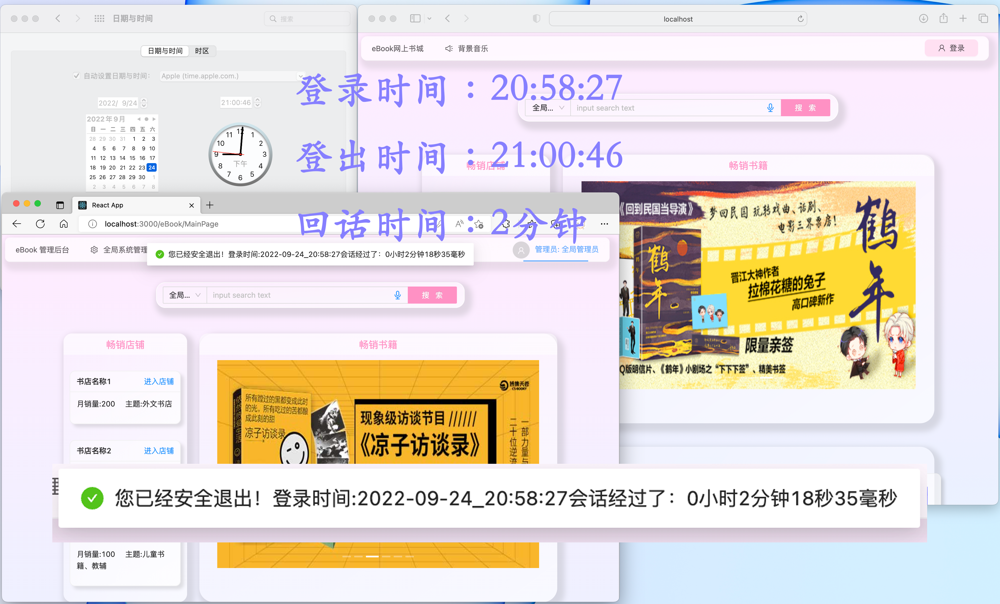

### 作业一

#### 1、设计时钟控制器类

##### 1-1、代码内容

按照要求，我设计了一个时钟Service：`ClockService`

接口部分代码：

```java
package com.zzq.ebook.service;

public interface ClockService {
  	// 提供两个函数，一个是发起时钟，一个是终止时钟
    public String launchClock();
    public String endClock();
}

```

实现部分代码：

下面的部分是控制器层的内容

```java
// import 部分省略

@RestController
@Scope(value = WebApplicationContext.SCOPE_SESSION)
public class loginControl {
    @Autowired
    private UserService userService;
    @Autowired
    private ClockService clockService;
    @RequestMapping("/login")
    public Msg login(@RequestBody Map<String, String> params){
        // 解析参数
        String username = params.get(constant.USERNAME);
        String password = params.get(constant.PASSWORD);
        Msg tmpMsg = userService.loginUserCheck(username,password);
        // 登录成功 发起计时器
        if(tmpMsg!=null && tmpMsg.getStatus() >= 0) {
            clockService.launchClock();
            return tmpMsg;
        }
        return null;
    }

    @RequestMapping("/logout")
    public Msg logout(){
        Boolean status = SessionUtil.removeSession();
        if(status){
            // 成功移除回话，终止闹钟
            String timeIntervalInfo = clockService.endClock();
            JSONObject data = new JSONObject();
            data.put("timeInfo", timeIntervalInfo);
            return MsgUtil.makeMsg(MsgCode.SUCCESS, MsgUtil.LOGOUT_SUCCESS_MSG, data);
        }
        return MsgUtil.makeMsg(MsgCode.ERROR, MsgUtil.LOGOUT_ERR_MSG);
    }
}
```


下面的部分是服务层的代码：

```java
// import 部分省略

@Service
@Scope(value = WebApplicationContext.SCOPE_SESSION)
public class ClockServiceImp implements ClockService {

    long launchTime = 0;
    String launchTimeStr = "";

    @Override
    public String launchClock() {
        // 设置判断的要确认当前的计时器未发起，避免重复发起
        if(launchTime == 0){
            this.launchTime = System.currentTimeMillis();
            SimpleDateFormat simpleDateFormat = new SimpleDateFormat("yyyy-MM-dd_HH:mm:ss");
            this.launchTimeStr  = simpleDateFormat.format(new Date(launchTime));
        }
        return launchTimeStr;
    }

    @Override
    public String endClock() {
        if(launchTime > 0){
            long time_interval = (System.currentTimeMillis() - launchTime);
            launchTime = 0;
            long hh = time_interval / 1000 / 3600;
            long mm = (time_interval / 1000 % 3600) / 60;
            long ss = (time_interval / 1000 % 3600) % 60;
            long ms = (time_interval - (3600 * hh + 60 * mm + ss) * 1000 );

            return  "登录时间:" + launchTimeStr + "会话经过了：" + hh + "小时" + mm + "分钟" + ss + "秒" + ms + "毫秒";
        }
        else
            return "计时器未发起";
    }
}

```

##### 1-2、结果展示：

由于截屏的时间可能会有1s的延迟，所以误差在允许的范围之内。


用户2登出


用户1登出




##### 1-3、理由解释

先说服务层的计时器类，为什么采用session存储：

- singleton：单例，如果用这种方法，就不能区分两个用户的会话时间，除非只有一个用户在线，才能保证计时器有效，否则另外一个用户的退出都会导致计时器终止。

- prototype：多例，假如一个人在同一个浏览器里面登录两次，那么会生成两个计时器服务类，造成浪费，

- session：将单个bean定义范围限定为HTTP的生命周期Session，仅在Web感知Spring的上下文中有效ApplicationContext。相当于数量和客户端对应，一个浏览器里面就对应一个service。

再说控制层的控制器类，为什么采用session存储：

- 如果用singleton：单例，如果控制器只有一个，那么按照工厂模式推送的计时器服务也只有一个，同样不能完成计时功能
- 如果用prototype，终止的时候，不能读取到计时器发起的时间。也就说退出登录的时候相当于又创建了一个计时器类，这个计时器还没有初始化，读取不了，完成不了这个功能
- 显然session是最优的！理由上面也已经叙述了。


#### 2、订单的事务控制

##### 2-1、下订单的种类简介

综合考虑了现实中的一些情形，下订单有两种类型，当然也对应后端的两个服务层函数：

- 用户将多个/某个商品放到购物车里面，然后统一结算
- 用户在单个商品的详情界面，直接下单，这时候用户买的是一件商品（当然，商品数量可以自定义）

由于我在数据库中存储的时候，是将购物车项目还有订单项目统一视作Ordertem的，通过一个状态Status表示订单的状态：

- 状态 0-在购物车中 
- 1-归属于订单，但是未支付 
- 2-归属于订单，且已经支付
- 3-归属于订单，且已经完成的
- -1表示这个字段无效（已经撤销的订单）


##### 2-2、下订单的具体实现

如果是从购物车统一结算，经过考虑，下订单包括下面的步骤：

- 操作orderDao, 根据用户订单信息（收件人、地址、电话）创建新订单，并且保存起来，同时返回订单编号（供后面OrderItem写入）
- 针对用户买的每一种商品，依次处理：
  - 把状态从「购物车的项目」的更新为「已下单」，并累加计算价格
  - 操作相关书籍的库存还有销量数据
- 根据第一步获取的OrderID和上一步累加计算的总价格，再次写入到Order表中

```java

    // 下订单 来自购物车的订单
    // 订单业务逻辑，作为一组事务，提交，出现异常可以回滚，购物车里面可能有多个购买项目，需要逐一处理
    @Transactional(propagation = Propagation.REQUIRED, rollbackFor=Exception.class, isolation = Isolation.READ_COMMITTED)
    public int orderMakeFromShopCart(int [] bookIDGroup, int [] bookNumGroup, String username,
            String receivename, String postcode, String phonenumber, String receiveaddress, int size) throws Exception {
        // Step 0: 准备工作,初始化订单的总金额为0
        int totalMoney = 0;

        // Step 1: [增加] 操作orderDao, 根据用户订单信息创建新订单，并且保存
        // 说明：由于购物车中订单是用OrderItem表示的（用状态号区分是购物车的还是订单的），正式成为订单之前，
        //      需要创建一个新Order并获取此Order的ID号码 这个Order对象不包括他的ID，因为save之后会自动自增生成，
        //      然后我们通过获取实体，得到ID号码
      	// 事务：REQUIRED
        int orderID = orderDao.createOneOrderWithMultipleOrderItems
          (username,new Timestamp(System.currentTimeMillis()),
                receiveaddress,postcode,phonenumber,receivename).getOrderID();
        
        // Step 2 处理订单中的每一个项目：for循环处理
        for (int i = 0; i < size; i++){
            // Step 2-1: 操作orderItemDao，把购物车状态修改为已购买状态:2 ，返回实体获取价格
          	// 事务：REQUIRED
            OrderItem oneItem = orderItemDao.setOrderItemStatusByUsernameAndBookID
              (username,bookIDGroup[i],2,orderID);
            if(oneItem != null){
                totalMoney += oneItem.getPayprice();
                // Step 2-2: 操作bookDao，修改相关的数量，扣除购买的库存，增加销量，返回的数据要包括价格，然后把总价加起来
              	// 事务：REQUIRED
                bookDao.numInfoChange(bookIDGroup[i], bookNumGroup[i]);
            }
            else{
                throw new Exception("用户和订单不匹配");
            }
        }
        // 事务：REQUIRED
        // Step 3: 根据刚刚的orderID，修改订单的支付价格
        orderDao.setOrderPayPrice(orderID,totalMoney);
        return 0;
    }
```

如果是在商品详情页面购买，下订单包括下面的步骤：

- 查询书籍的价格，根据订单书籍数量等信息，操作orderDao, 根据用户订单信息（收件人、地址、电话）创建新订单，并且保存起来，同时返回订单编号（供后面OrderItem写入）
- 创建订单项目 OrderItem （只有一个）
- 操作书籍的库存信息（库存要减少，销量要增加）

```java

    @Transactional(propagation = Propagation.REQUIRED, rollbackFor=Exception.class，isolation = Isolation.READ_COMMETTED)
    public int orderMakeFromDirectBuy(int [] bookIDGroup, int [] bookNumGroup, String username,
        String receiveName, String postcode, String phoneNumber, String receiveAddress, int size) throws Exception {

        // 就一本书的话，就获取实体，检查库存
      	// 事务：SUPPORT
        Book targetBook = bookDao.getOneBookByID(bookIDGroup[0]);
        
      	// Step 1 创建订单 Order
        // 事务：REQUIRE
        int OrderID = orderDao.createOneOrderWithOneOrderItem(username,new Timestamp(System.currentTimeMillis()),
                receiveAddress,postcode,phoneNumber,receiveName,
                targetBook.getPrice() * bookNumGroup[0]).getOrderID();

        // Step 2 创建订单项目 OrderItem
      	// 事务：REQUIRE
        orderItemDao.createOrderItem(2,username,OrderID,bookIDGroup[0],bookNumGroup[0],
                targetBook.getPrice() * bookNumGroup[0],
                new Timestamp(System.currentTimeMillis()));

        // Step 3 操作库存信息
      	// 事务：REQUIRE
        bookDao.numInfoChange(bookIDGroup[0], bookNumGroup[0]);

        return 0;
    }
```

上面的设计都是经过了慎重的考虑，例如有下面几个常见的问题：

- **问题一：上面下订单的逻辑中，几组操作Dao的顺序能不能调换？**

- 回答：不可以！操作OrderItemDao的结果依赖于操作OrderDao的结果，而最终还需要把订单的总价写入，订单的总价计算需要依赖上面的操作结果，所以环环相扣，不能调换顺序。

- **问题二：为什么要把书籍销量等数据的操作放在最后，有没有库存溢出的风险？**

- 回答：没有溢出的风险，因为在函数` numInfoChange` 的实现如下，首先会检查销量。而书籍销量放在最后检查的原因是最大限度的避免脏读（当然也可以通过隔离实现，不过这次作业没有要求就暂时不写hhh，试想如果一开始就检查库存，可能会因为库存增加或者有人退货，而导致务报错。）

  ```java
      @Override
      @Transactional(propagation = Propagation.REQUIRED, rollbackFor=Exception.class)
      public Book numInfoChange(int bookID, int buyNum) throws Exception {
          Book book = bookRepository.getOne(bookID);
          if(book.getInventory() < buyNum)
              throw new Exception("购买数量超过库存！");
          // 扣除库存，增加销量
          book.setInventory(book.getInventory() - buyNum);
          book.setSellnumber(book.getSellnumber() + buyNum);
          return bookRepository.save(book);
      }
  ```

- **问题三：为什么在通过购物车下单的时候，首先要创建订单，然后在最后才写入订单的价格？而不是在创建订单的时候写入价格？**

- 回答：首先创建订单，提交到数据库中，才能获取这个订单的ID号码，这个ID号码后期是要写入每一个OrderItem的数据中的。然后，只有把所有的OrderItem操作完了，整个订单的总价格才能计算出来，所以到最后才能写入！


##### 2-3、propagation的配置理由

首先，两种下单逻辑下，服务层的事务配置都是 REQUIRED，Require代表的是如果有事务那么就加入事务，如果没有事务那么就自己开启一个事务，这是默认的条件。服务层里面的两个下订单函数`orderMakeFromDirectBuy`和`orderMakeFromShopCart`不会被包含在其他事务中，所以Require也是合理的配置。当然，**不能配置**为`NOT_SUPPORT` 、`NEVER`、`SUPPORT` 的类型。

然后就不得不说这两个下订单函数体中的子函数（涉及到Dao的操作），基本可以分为两类：

- 下订单专用的DAO函数（配置为：REQUIRED）理由：必须要加入下订单的这个事务，因为这些函数涉及到修改数据库的订单操作，操作一旦出错，整个下订单的事务必须要回滚（要确保不能部分作为一个事务成功执行了，部分执行会导致数据库的错乱、不一致的数据）
- 下订单用到的查询函数，但不是专门给下订单用的，别的一些函数也可能用到的查询函数（配置为：Support）这是因为下订单过程中，是一个事务，配置查询函数为Support的话，可以让查询函数也加入事务【一旦订单中包括一些比如非法的书籍ID，可以抛出异常】，但是在一些别的业务中，没有必要开启事务，所以就没有必要浪费资源。


##### 2-4、举例说明

|      | 1、创建订单Order | 2、编辑订单状态[for中] | 3、改书籍销量、库存[for中] |      4、订单价格再写入       |         5、下单函数中某步          |                             结果                             |
| :--: | :--------------: | :--------------------: | :------------------------: | :--------------------------: | :--------------------------------: | :----------------------------------------------------------: |
|  1   |       正常       |          正常          |            正常            |             正常             |                正常                |                             正常                             |
|      |                  |                        |                            |                              |                                    |                                                              |
|  2   |   `int a=1/0;`   |          正常          |            正常            |             正常             |                正常                |                        报错，全部回滚                        |
|  3   |       正常       |      `int a=1/0;`      |            正常            |             正常             |                正常                |                        报错，全部回滚                        |
|  4   |       正常       |          正常          |        `int a=1/0;`        |             正常             |                正常                |                        报错，全部回滚                        |
|  5   |       正常       |          正常          |            正常            |         `int a=1/0;`         |                正常                |                        报错，全部回滚                        |
|  6   |       正常       |          正常          |            正常            |             正常             |     任何位置加一个`int a=1/0;`     |                        报错，全部回滚                        |
|      |                  |                        |                            |                              |                                    |                                                              |
|  7   |       正常       |          正常          |            正常            |        `Requires_NEW`        |                正常                |                             正常                             |
|  8   |       正常       |          正常          |            正常            | `Requires_NEW`且`int a=1/0;` |                正常                | **订单价格再写入**步骤回滚，但是不影响下单事务，下单事务成功 |
|  9   |   `int a=1/0;`   |          正常          |            正常            |        `Requires_NEW`        |                正常                |                        报错，全部回滚                        |
|  10  |       正常       |      `int a=1/0;`      |            正常            |        `Requires_NEW`        |                正常                |                        报错，全部回滚                        |
|  11  |       正常       |          正常          |        `int a=1/0;`        |        `Requires_NEW`        |                正常                |                        报错，全部回滚                        |
|  12  |       正常       |          正常          |       `Requires_NEW`       |             正常             | return前一步加一个异常`int a=1/0;` |     书籍销量/库存修改成功，其他的所有修改回滚，下单失败      |
|  13  |   `int a=1/0;`   |          正常          |       `Requires_NEW`       |             正常             | return前一步加一个异常`int a=1/0;` |                        报错，全部回滚                        |

**解释说明：**

- 1-6、7、9-11都是正常的事务遇到报错就回滚的原理，无需多赘述。
- 8 中，由于第四步新开了一个事务，在这个新开的事务里面，遇到错误，不影响已经挂起的事务，所以挂起的事务（下单）执行成功，但是仅仅第四步失败回滚。这是一个不好的结果。
- 12 中，由于第三步新开了一个事务，把旧的事务挂起了，新事务没有异常，提交完成，但是旧的事物里面最后遇到了一个错误，所以下单失败，但是书籍的销量信息修改成功。
- 12和13是非常类似的，但是13一开始就遇到错误了，所以直接回滚，后面的都不需要执行。

- 当然，事物传播属性还有一些MANDATORY，NEVER，NOT_SUPPORT，但是考虑到**这些属性显然是不符合要求**的，甚至会导致服务器无法启动，所以上表中没有列出，理由如下：
  - 如果把整个下订单作为一个NEVER，或者将下订单里面的DAO操作函数设置为NEVER，服务器都不能启动
  - 至于MANDATORY，这个是说必须要在已有的事务中执行，如果DAO函数只在下订单事务中出现，可以！但是如果DAO函数（比如一些读函数）在其他的业务逻辑服务函数（没有作为一个事务）也掉用了，那么就会报错

##### 2-4、隔离设置

我的设置为：Read Committed，理由如下：

- 一个事务只能读取别的事务已经提交的结果，防止脏读（比如读取到别的事务没有提交的结果，但是别的这个事务执行失败回滚了）
- 如果用最严格的机制，采用串行执行，会不经济。
- Read Committed中，如果别的事务已经提交了的结果（比如增加了库存），在事务中可以成功的读取到，避免下订单的时候，由于更新不及时导致的下单失败的问题。而且，在下订单的过程中，没有多次同时读取同一个数据的情况，所以暂时没有必要回避不可重复读的问题。


