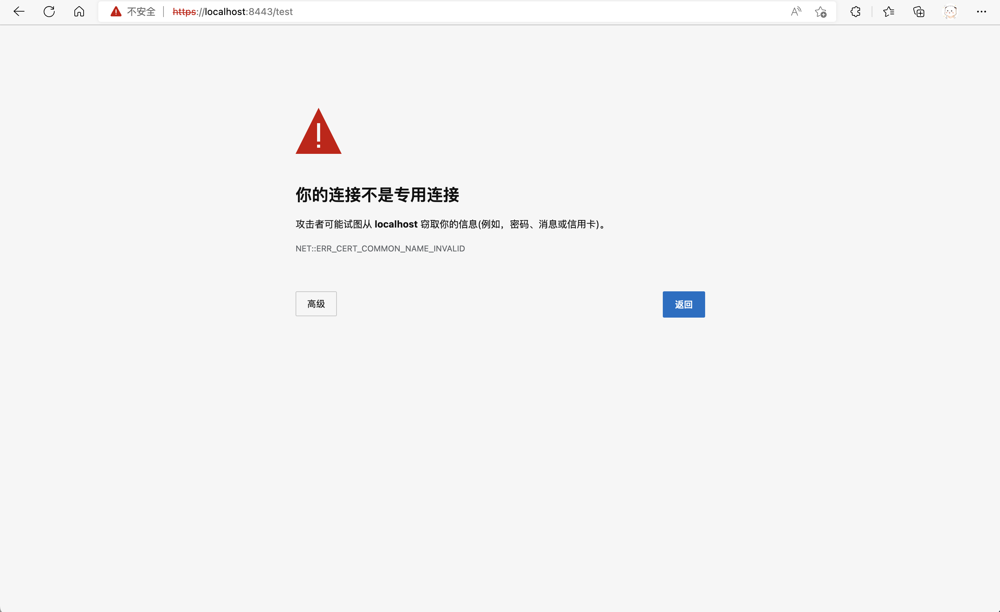

#### 作业四：SSL

#### 第一部分 代码部分

将8080的Http转发到8443的端口代码：通过connector实现如下！

```java

@SpringBootApplication
public class EBookBackendApplication {

    @Bean
    public TomcatServletWebServerFactory tomcatServletWebServerFactory(Connector connector){
        TomcatServletWebServerFactory tomcat=new TomcatServletWebServerFactory(){
            @Override
            protected void postProcessContext(Context context) {
                SecurityConstraint securityConstraint=new SecurityConstraint();
                securityConstraint.setUserConstraint("CONFIDENTIAL");
                SecurityCollection collection=new SecurityCollection();
                collection.addPattern("/*");

                securityConstraint.addCollection(collection);
                context.addConstraint(securityConstraint);

            }
        };
        tomcat.addAdditionalTomcatConnectors(connector);
        return tomcat;
    }
    @Bean
    public Connector connector(){
        Connector connector=new Connector("org.apache.coyote.http11.Http11NioProtocol");
        connector.setScheme("http");
        connector.setPort(8080);
        //Set the secure connection flag that will be assigned to requests received through this connector.
        //@param secure The new secure connection flag
        //if connector.setSecure(true),the http use the http and https use the https;
        // else if connector.setSecure(false),the http redirect to https;
        connector.setSecure(false);
        connector.setRedirectPort(8443);
        connector.setAllowTrace(true);

        return connector;
    }

    public static void main(String[] args) {
        SpringApplication.run(EBookBackendApplication.class, args);
    }

}

```

#### 第二部分 问题回答

**HTTPS 通信方式与HTTP 通信方式的差异：**

- HTTP是明文传输内容的，可能会被截获，不安全。HTTPs的传输内容经过了公钥的加密，所以更安全。
- 默认的端口不一样，HTTP默认端口80，HTTPS默认443，对应后端的分别是8080和8443端口
- 使用 HTTPS 协议需要到 CA（Certificate Authority，数字证书认证机构） 申请证书，一般免费证书较少，因而需要一定费用。证书颁发机构如：Symantec、Comodo、GoDaddy 和 GlobalSign 等。
- HTTPS 其实就是建构在 SSL/TLS 之上的 HTTP 协议，所以，要比较 HTTPS 比 HTTP 要更耗费服务器资源。


**解释为什么会出现和之前只使用HTTP 时的差异，为什么需要导入证书才能正常访问，并且将你生成证书和导入证书的过程，用Shell 命令和截图进行说明。**

之前只使用HTTP的时候，浏览器的标识处写的是不安全，现在用了自己签名的证书后，Edge提示的是红色的不安全，Safari没有不安全提示（证书已经导入到了系统中）。Safari是系统自带的浏览器可以读取相关的证书目录发现是用户自己的证书所以信任，Edge在未导入证书之前的情况是完全不能访问的（也就是没有任何按钮可以强制访问这个网站），导入证书之后，可以通过高级选项，访问这个网站。



自签名证书容易受到SSL中间人攻击，所以自签名证书是不会被浏览器所信任的证书，用户在访问自签证书时，浏览器会警告用户此证书不受信任，需要人工确认是否信任此证书。所有使用自签证书的网站都明确地告诉用户出现这种情况，用户必须点信任才可以继续浏览。

关于为什么需要导入证书才能正常访问，浏览器在访问网站的时候详细的过程如下：

- 首先浏览器通过URL网址去请求服务端，服务端接收到请求后，就会给浏览器发送一个自己的证书
- 浏览器接收到证书以后，就要开始进行验证工作了。首先从证书中得知证书的颁发机构，然后从浏览器系统中去寻找此颁发机构的根证书。CA机构的根证书都是预先嵌入到浏览器中的，如果在浏览器系中没有找到对应的根证书，就代表此机构不是受信任的，那么就会警告无法确认证书的真假。
- 如果是在系统中找到了相关的证书，但是考虑到这个证书是自签名的，所以会提示用户是否信任网站
- 否则找不到的话，就可能会强制阻止访问网站。

所以综上所述，需要导入证书才能正常访问。

#### 第三部分 步骤解释

##### 第一步：产生keystore文件

```
zhangziqian@zhangziqiandeMac-Studio /bin % keytool -genkey -v -keystore zzq.keystore -alias zhangziqian -keyalg RSA -validity 365 -keystore /Users/zhangziqian/Desktop/zzq.keystore
输入密钥库口令:  
再次输入新口令: 
Warning:
多次指定了 -keystore 选项。除最后一个之外, 其余的将全部忽略。
您的名字与姓氏是什么?
  [Unknown]:  zhangziqian
您的组织单位名称是什么?
  [Unknown]:  sjtu
您的组织名称是什么?
  [Unknown]:  sjtu
您所在的城市或区域名称是什么?
  [Unknown]:  shanghai
您所在的省/市/自治区名称是什么?
  [Unknown]:  shanghai
该单位的双字母国家/地区代码是什么?
  [Unknown]:  CN
CN=zhangziqian, OU=sjtu, O=sjtu, L=shanghai, ST=shanghai, C=CN是否正确?
  [否]:  是

正在为以下对象生成 2,048 位RSA密钥对和自签名证书 (SHA256withRSA) (有效期为 365 天):
	 CN=zhangziqian, OU=sjtu, O=sjtu, L=shanghai, ST=shanghai, C=CN
[正在存储/Users/zhangziqian/Desktop/zzq.keystore]
```

##### 第二步：导出cer后缀的证书

```
zhangziqian@zhangziqiandeMac-Studio key % keytool -export -alias zhangziqian -keystore ./zzq.keystore -rfc -file ./zzq.cer
输入密钥库口令:  
存储在文件 <./zzq.cer> 中的证书
```

##### 第三步：导入系统

如下图所示，导入后的结果可以在钥匙串中看到！


##### 第四步：打开浏览器访问测试接口

Edge的截图如下：


回车访问，发现被重定向到了8443


Safari可以识别系统的用户证书：


