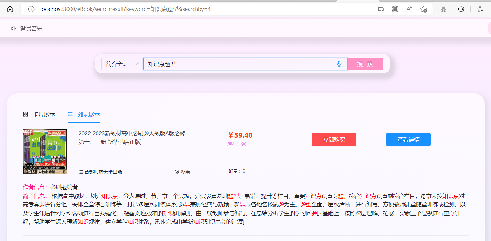

### 作业六：全文搜索

> 本次作业使用Elastic Search搜索引擎，分词器使用开源的Elasticsearch IK 分词器（支持一些中文分词）。由于Elastic Search的飞快的版本更新，新版本中往往废弃了一些旧有的特性，同时还增加了一些安全性质的检查，导致出现和Spring不兼容的问题时常发生。所以本次作业的环境要求非常严格，乃至于我升级了我的底层的Spring版本。

[TOC]

#### 一、环境配置

##### （1）版本概述

首先我们参考一下Spring Data Release中Elastic Search的官网数据。我经过了无数的折磨式测试，得出目前的使用版本组合（基本就是只要有一个不一致整个系统都不能正常的运行，依赖要求很严格）：

- SpringBoot2.3.7.RELEASE
- Elasticsearch 7.6.2
- LK分词器 7.6.2（和Elasticsearch的版本号码一样）‘
- Spring Data Elasticsearch 4.0.0

|                  Spring Data Release Train                   |                  Spring Data Elasticsearch                   | Elasticsearch | Spring Framework | Spring Boot |
| :----------------------------------------------------------: | :----------------------------------------------------------: | :-----------: | :--------------: | :---------: |
|                         2021.2 (Raj)                         |                            4.4.x                             |    7.17.6     |      5.3.x       |    2.7.x    |
|                          2021.1 (Q)                          |                            4.3.x                             |    7.15.2     |      5.3.x       |    2.6.x    |
|                       2021.0 (Pascal)                        | 4.2.x[[1](https://docs.spring.io/spring-data/elasticsearch/docs/current/reference/html/#_footnotedef_1)] |    7.12.0     |      5.3.x       |    2.5.x    |
| 2020.0 (Ockham)[[1](https://docs.spring.io/spring-data/elasticsearch/docs/current/reference/html/#_footnotedef_1)] | 4.1.x[[1](https://docs.spring.io/spring-data/elasticsearch/docs/current/reference/html/#_footnotedef_1)] |     7.9.3     |      5.3.2       |    2.4.x    |
| Neumann[[1](https://docs.spring.io/spring-data/elasticsearch/docs/current/reference/html/#_footnotedef_1)] | 4.0.x[[1](https://docs.spring.io/spring-data/elasticsearch/docs/current/reference/html/#_footnotedef_1)] |     7.6.2     |      5.2.12      |    2.3.x    |
| Moore[[1](https://docs.spring.io/spring-data/elasticsearch/docs/current/reference/html/#_footnotedef_1)] | 3.2.x[[1](https://docs.spring.io/spring-data/elasticsearch/docs/current/reference/html/#_footnotedef_1)] |    6.8.12     |      5.2.12      |    2.2.x    |
| Lovelace[[1](https://docs.spring.io/spring-data/elasticsearch/docs/current/reference/html/#_footnotedef_1)] | 3.1.x[[1](https://docs.spring.io/spring-data/elasticsearch/docs/current/reference/html/#_footnotedef_1)] |     6.2.2     |      5.1.19      |    2.1.x    |
| Kay[[1](https://docs.spring.io/spring-data/elasticsearch/docs/current/reference/html/#_footnotedef_1)] | 3.0.x[[1](https://docs.spring.io/spring-data/elasticsearch/docs/current/reference/html/#_footnotedef_1)] |     5.5.0     |      5.0.13      |    2.0.x    |
| Ingalls[[1](https://docs.spring.io/spring-data/elasticsearch/docs/current/reference/html/#_footnotedef_1)] | 2.1.x[[1](https://docs.spring.io/spring-data/elasticsearch/docs/current/reference/html/#_footnotedef_1)] |     2.4.0     |      4.3.25      |    1.5.x    |

##### （2）升级Spring框架

由于我之前用的Spring是2.2的，2.2对应的Spring Data Elasticsearch依赖不支持`@Highlight`的注解形式，所以代码会有一些报错。我的解决方案是稍加升级springframework的框架，如果升级的版本过新也会因为诸如Java版本的缘故导致不兼容。（升级过程如下）

```xml
    <parent>
        <groupId>org.springframework.boot</groupId>
        <artifactId>spring-boot-starter-parent</artifactId>
        <version>2.3.7.RELEASE</version>
        <relativePath/> 
        <!-- lookup parent from repository -->
        <!--    <groupId>org.springframework.boot</groupId>-->
        <!--    <artifactId>spring-boot-starter-parent</artifactId>-->
        <!--    <version>2.2.0.RELEASE</version>-->
        <!--    <relativePath/> &lt;!&ndash; lookup parent from repository &ndash;&gt;-->
    </parent>
```

##### （3）安装Elasticsearch 7.6.2

如果遇到问题：windows启动elasticsearch报错：warning: Falling back to java on path. This behavior is deprecated. Specify JAVA_HOME：解决方法：设置windows系统的环境变量（JAVA_HOME设置为java的目录即可），此外Elasticsearch 的最新版本加入了鉴权和用户名、密码认证，所以配置会更加复杂一些。启动的方法是切到下载的elastic目录下面。

```
bin\elasticsearch.bat
```

##### （4）LK分词器 7.6.2

根据官网[LK分词器](https://github.com/medcl/elasticsearch-analysis-ik/releases)下载，必须要和Elasticsearch 版本对应。安装在Elasticsearch 的插件文件夹里面即可。然后Elasticsearch 会自动的检索。

##### （5）spring-data-elasticsearch依赖

修改Pom文件的依赖，版本4.0.0。

```
        <dependency>
            <groupId>org.springframework.data</groupId>
            <artifactId>spring-data-elasticsearch</artifactId>
            <version>4.0.0.RELEASE</version>
        </dependency>
```

#### 二、效果演示

##### （一）单词搜索演示效果

当我搜索写作的时：


当我搜索知识点的时候（如地址栏里面所示）：（当然我数据库里面由于之前失误，有几本比必刷题的书是重复的，所以也搜出来了，这里就不展示重复的书了）


##### （二）多词搜索演示效果

当然，我对于只能支持单关键词搜索是很不满意的，所以经过一通查资料，然后加了亿点点功能(现在可以自动断开搜索的文本)【例如我搜索的是知识点题型，他会首先优先的断开成几个词语：知识点、题型、等等】：




当然说实话还有一些无关的有的没的之类命中了的搜索结果（如下图），目前来看只能说数据库里面的样本太少了，只有一个词语或文字匹配了，所以搜索引擎按照排序规则就把他放在后面。这也是符合我们的预期的。


#### 三、问题解释

**问题：能够按照你设计的功能充分阐述索引中各个 Field 的设计理由（2 分）**

回答：由于我使用了ES的搜索引擎，ES搜索引擎最强大的特性是他可以类似我们之前写的JPA一样，通过一个repository做ORM对象关系映射，所以自然而然就需要一个新的实体类（尽管这个类和之前的参数基本都是一致的，但是由于一些annotation的差异，不得不需要新建一个避免和原来的混淆）我单独建立了一个实体类，叫做ESBook。

按照我们上课讲的，Field可以分为下面几种类型（尽管和ES的搜索引擎有一定的差异，但是还是对照着说）

- Keyword：Isn’t analyzed, but is indexed and stored in the index verbatim. 
- UnIndexed：Is neither analyzed nor indexed, but its value is stored in the index as is. 
- UnStored：The opposite of UnIndexed. This field type is analyzed and indexed but isn’t stored in the index. 
- Text：Is analyzed, and is indexed. This implies that fields of this type can be searched against, but be cautious about the field size.

那么具体的对应信息是：

- 书籍的描述信息就要对应Text，他不存储在索引中，但是需要建立反向索引。
- 书籍的库存信息、销量信息、图片的URL信息、价格信息、作者：UnIndexed，不分析、不建立索引，但是要存在索引里面，比如用户搜一个书籍，要一块把这个价格信息、作者信息一块带出来。这些信息都是很短的文本。
- 书籍的标题：对应Keyword，一个整体作为检索（当然也不是一定要，毕竟如果有些书名字很长，所以这个可以自由选择）

我们这次的搜索主要的目标是全文搜索书籍的描述信息，那就需要在这个字段建立反向索引。

然后我们考虑到数据库里面的书都是中文的文本，那就需要有专门针对中文的分析器Analyser：也就是ik_max_word和ik_smart。


ik_max_word分词器，这个分词器的特性会把：例如会将文本做最细粒度的拆分，比如会将“中华人民共和国人民大会堂”拆分为“中华人民共和国、中华人民、中华、华人、人民共和国、人民、共和国、大会堂、大会、会堂等词语，但是ik_smart只会分成中华人民共和国、人民大会堂。索引时用ik_max_word，这样会把词组的划分最大化，但是在搜索时用ik_smart，尽可能的匹配最大化。这也是对应我的Description的设置规则。

```java
// 考虑到ES引擎和我们上课讲的有所差异，所以下面的代码中也做了适配
// 这里的type对应的是变量类型，分析器指定与否决定是否分析
// ESbook.java实体类
package com.zzq.ebook.entity;


import lombok.Data;
import org.springframework.data.annotation.Id;
import org.springframework.data.elasticsearch.annotations.Document;
import org.springframework.data.elasticsearch.annotations.Field;
import org.springframework.data.elasticsearch.annotations.FieldType;

// 整个实体类参考Book，但是为了避免混淆、适应ES的搜索引擎，所以我单独建立了一个实体
// 考虑到整个搜索中分词器的特性，我们需要在建立索引的时候使用ik_max_word分词器，
// 这个分词器的特性会把：例如会将文本做最细粒度的拆分，比如会将“中华人民共和国人民大会堂”
// 拆分为“中华人民共和国、中华人民、中华、华人、人民共和国、人民、共和国、大会堂、大会、会堂等词语。
// 索引时用ik_max_word，这样会把词组的划分最大化，
// 但是在搜索时用ik_smart，尽可能的匹配最大化。这也是对应我的Description的内容。

@Data
@Document(indexName = "book")
public class ESBook {
    @Id
    @Field(type = FieldType.Integer)
    private int ID;

    @Field(type = FieldType.Text)
    private String ISBN;

    @Field(type = FieldType.Text,index = false)
    private String bookname;

    @Field(type = FieldType.Text,analyzer = "ik_max_word")
    private String displaytitle;

    public int getID() {
        return ID;
    }

    public void setID(int ID) {
        this.ID = ID;
    }

    @Field(type = FieldType.Integer,index = false)
    private int inventory;

    @Field(analyzer = "ik_max_word",type = FieldType.Text)
    private String departure;

    @Field(analyzer = "ik_max_word",type = FieldType.Text)
    private String author;

    @Field(type = FieldType.Integer,index = false)
    private int price;

    @Field(type = FieldType.Integer,index = false)
    private int sellnumber;

    @Field(type = FieldType.Text,index = false)
    private String imgtitle;

    @Field(analyzer = "ik_max_word",type = FieldType.Text)
    private String publisher;

    @Field(analyzer = "ik_smart", searchAnalyzer = "ik_max_word",type = FieldType.Text)
    private String description;

    public ESBook(){}
    public ESBook(Book book){
        this.ID = book.getID();
        this.ISBN = book.getISBN();
        this.bookname = book.getBookname();
        this.displaytitle = book.getDisplaytitle();
        this.inventory = book.getInventory();
        this.departure = book.getDeparture();
        this.author = book.getAuthor();
        this.price = book.getPrice();
        this.sellnumber = book.getSellnumber();
        this.imgtitle = book.getImgtitle();
        this.publisher = book.getPublisher();
        this.description = book.getDescription();
    }
}

```

#### 四、代码编写

##### （1）配置类

​	配置好端口和IP，连接到ES。

```java
package com.zzq.ebook.config;

import org.elasticsearch.client.RestHighLevelClient;
import org.springframework.context.annotation.Bean;
import org.springframework.context.annotation.Configuration;
import org.springframework.data.elasticsearch.client.ClientConfiguration;
import org.springframework.data.elasticsearch.client.RestClients;
import org.springframework.data.elasticsearch.config.AbstractElasticsearchConfiguration;

/**
 * ElasticSearch 客户端配置
 * @Author张子谦
 */
@Configuration
public class RestClientConfig extends AbstractElasticsearchConfiguration {
    @Override
    @Bean
    public RestHighLevelClient elasticsearchClient() {
        final ClientConfiguration clientConfiguration = ClientConfiguration.builder()
                .connectedTo("localhost:9200")
                .build();
        return RestClients.create(clientConfiguration).rest();
    }
}
```

##### （2）添加实体和Repository

ES使用了一套专门自己的查询语言，这个语言是通过JSON结构的语句查询的。

```java
package com.zzq.ebook.repository;
import com.zzq.ebook.entity.ESBook;
import org.springframework.data.elasticsearch.annotations.Highlight;
import org.springframework.data.elasticsearch.annotations.HighlightField;
import org.springframework.data.elasticsearch.annotations.Query;
import org.springframework.data.elasticsearch.core.SearchHits;
import org.springframework.data.elasticsearch.repository.ElasticsearchRepository;
import java.util.List;
public interface ESBookRepository extends ElasticsearchRepository<ESBook, String> {

    List<ESBook> findAll();
    // 经过优化后的搜索查询语句，可以支持多字段切开后搜索
    @Highlight(fields = {
            @HighlightField(name = "description")
    })
    @Query("{\"multi_match\":{\"fields\": [\"description\"],\"query\":\"?0\"}}")
    SearchHits<ESBook> findByDescription(String keyword);
    
    // 测试接口
    @Highlight(fields = {
            @HighlightField(name = "description")
    })
    List<ESBook> findByDescriptionLike(String keyword);
}

//      其他可以选用的查询语句，但是效果不是很好
//      @Query("{\"match\":{\"description\":\"?0\"}}")
//      @Query("{\"match_phrase\":{\"description\":\"?0\"}}")
```

##### （3）从数据库迁移ES

为了解决数据兼容的问题，我专门编写了一个测试类。只要访问`localhost:8080/init`就可以清空当前的索引，然后把数据从书的表里面全部读取，放入ES的索引。由于我们使用了ORM映射，所有的内容变得和JPA非常的类似。（在control类里面直接调用repository有些不合规范，但是为了演示方便就不编写更多的逐层传递）

```java
package com.zzq.ebook.controller;

import com.zzq.ebook.entity.Book;
import com.zzq.ebook.entity.ESBook;
import com.zzq.ebook.repository.BookRepository;
import com.zzq.ebook.repository.ESBookRepository;
import com.zzq.ebook.service.BookService;
import org.springframework.beans.factory.annotation.Autowired;
import org.springframework.data.elasticsearch.core.SearchHits;
import org.springframework.web.bind.annotation.RequestMapping;
import org.springframework.web.bind.annotation.RestController;
import java.util.List;
@RestController
public class testControl {

    @Autowired
    BookService bookService;

    @Autowired
    BookRepository bookRepository;

    @Autowired
    ESBookRepository esBookRepository;

    // 测试的接口函数
    // 将书籍迁移到es中
    @RequestMapping("/init")
    public List<ESBook> initFunction(){
        esBookRepository.deleteAll();
        List<Book> allBooks = bookRepository.findAll();
        for (Book allBook : allBooks) {
            ESBook tmpES = changeToESBook(allBook);
            esBookRepository.save(tmpES);
        }
        return esBookRepository.findAll();
    }
  
    @RequestMapping("/findtest")
    public SearchHits<ESBook> testFunction(){
        esBookRepository.deleteAll();
        List<Book> allBooks = bookRepository.findAll();
        for (Book allBook : allBooks) {
            ESBook tmpES = new ESBook(allBook);
            esBookRepository.save(tmpES);
        }
        return esBookRepository.findByDescription("书");
    }
}
```

##### （4）修改前端

由于我后端之前写的接口是接收POST请求，请求参数需包括关键词和搜索种类，所以我直接在搜索种类吗增加一个全文搜索就可以快速把新的功能集成进去。

##### （5）协调后端ESBook和Book

为了节省前端代码的改变量（也就是我**保证我的搜索接口是不变的**），所以我需要返回的内容格式也是根之前一样，是一个`List<Book>`。但是ES搜索的结果返回的是`SearchHits<ESBook> `类，里面有一个字段是Highlight字段，包括了经过处理后的带有加粗`<em>`标签显示的文本字段，所以需要转换字段。

```java
	// 这个是我原来的搜索书的服务层函数
	// 可以看到我只需要switch里面增加一个4号就可以识别。
	// 同时需要转换为List<Book>  我是通过函数ESHitsToBook实现的
	public List<Book> getSearchedBooks(int type, String keyword){
        keyword = "%"+ keyword +"%";
        System.out.println(bookDao.findBooksGlobal(keyword));

        // 0-全局搜 1-书籍名搜 2-出版社搜 3-作者搜 4-描述全文搜索（本次作业新增内容）
        switch (type){
            case 0:
                return bookDao.findBooksGlobal(keyword);
            case 1:
                return bookDao.findBooksByDisplaytitleLike(keyword);
            case 2:
                return bookDao.findBooksByPublisherLike(keyword);
            case 3:
                return bookDao.findBooksByAuthorLike(keyword);
            case 4:
                return ESHitsToBook(bookDao.findESBooksByDescription(keyword));
            default:
                break;
        }

        return null;
    }

		// 这个函数用来转换，同时把高亮的字段修改（代码中将这一部分移动到了工具函数类）
    private List<Book> ESHitsToBook(SearchHits<ESBook> searchHits){
        List<Book> books = new ArrayList<>();
        for (SearchHit<ESBook> hit : searchHits){
            ESBook esBook = hit.getContent();
            Book book = new Book();
            book.setAuthor(esBook.getAuthor());
            book.setBookname(esBook.getBookname());

            book.setDisplaytitle(esBook.getDisplaytitle());
            book.setDeparture(esBook.getDeparture());

            book.setDescription(hit.getHighlightField("description").toString());

            book.setInventory(esBook.getInventory());
            book.setISBN(esBook.getISBN());
            book.setImgtitle(esBook.getImgtitle());

            book.setSellnumber(esBook.getSellnumber());
            book.setPrice(esBook.getPrice());
            book.setID(esBook.getID());
            book.setPublisher(esBook.getPublisher());
            books.add(book);
        }
        return books;
    }
```

##### （6）增删改查的处理

不可避免书籍会有增删改查的情况，所以我们也要更新ES索引里面的内容。这个操作在DAO里面进行。

比如我们之前的DAO的逻辑是在Redis里面查找/处理，然后再Repository，只需要在中间加一个ESRepository即可了。修改后如下代码：

```java
package com.zzq.ebook.daoImp;

import com.alibaba.fastjson.JSONArray;
import com.alibaba.fastjson.JSONObject;
import com.zzq.ebook.config.RedisConfig;
import com.zzq.ebook.dao.BookDao;

import com.zzq.ebook.entity.Book;
import com.zzq.ebook.entity.ESBook;
import com.zzq.ebook.repository.BookRepository;
import com.zzq.ebook.utils.redis.RedisUtil;


import com.zzq.ebook.repository.ESBookRepository;
import org.springframework.beans.factory.annotation.Autowired;
import org.springframework.data.domain.PageRequest;
import org.springframework.data.elasticsearch.core.SearchHits;
import org.springframework.stereotype.Repository;
import org.springframework.transaction.annotation.Propagation;
import org.springframework.transaction.annotation.Transactional;

import java.util.ArrayList;
import java.util.List;

@Repository
public class BookDaoImp implements BookDao {
    @Autowired
    private BookRepository bookRepository;

    @Autowired
    RedisUtil redisUtil;

    @Autowired
    private ESBookRepository esBookRepository;


    /**
     *   ************  基础查询的函数   ************  
     */
    
    @Override
    public SearchHits<ESBook> findESBooksByDescription(String keyword){
        return esBookRepository.findByDescription(keyword);
    }
    
    // Redis:通过ID获取书的信息的时候，book + [ID] 作为Redis存储的Key，
    // value为book转化为JSON字符串的内容
    // 操作逻辑：先在缓存里面找一下，找到了就直接返回，没找到就去数据库，并把找到的写入缓存
    @Override
    @Transactional(propagation = Propagation.SUPPORTS, rollbackFor=Exception.class)
    public Book getOneBookByID(Integer id){
        Book book;
        Object p = redisUtil.get("book"+id);
        if(p == null){
            book = bookRepository.getOne(id);
            redisUtil.set("book" + id, JSONArray.toJSON(book));
            System.out.println("通过数据库拿到的一本书");
        }
        else {
            book = JSONArray.parseObject(p.toString(),Book.class);
            System.out.println("通过Redis拿到的一本书");
        }
        return book;
    }


    // 获取所有的书，类比前面的，这个功能是给管理员用的，获取所有的书籍信息
    @Override
    public List<Book> getAllBooks(){
        List<Book> bookList = null;
        Object p = redisUtil.get("bookAll");
        if(p == null){
            bookList = bookRepository.findAll();
            redisUtil.set("bookAll", JSONArray.toJSON(bookList));
            System.out.println("通过数据库拿到的书[bookAll]");
        }
        else {
            bookList = (List<Book>) JSONObject.parseArray(p.toString(),Book.class);
            System.out.println("通过Redis拿到的书[bookAll]");
        }
        return bookList;
    }


    /**
     *   ************  修改类型的函数   ************  
     */
    
    // 功能：更新书的库存信息
    // Redis 操作相关：
    @Override
    @Transactional(propagation = Propagation.REQUIRED, rollbackFor=Exception.class)
    public Book numInfoChange(int bookID, int buyNum) throws Exception {
        Book book = bookRepository.getOne(bookID);
        if(book.getInventory() < buyNum)
            throw new Exception("购买数量超过库存！");
        // 扣除库存，增加销量
        book.setInventory(book.getInventory() - buyNum);
        book.setSellnumber(book.getSellnumber() + buyNum);

        // Redis 操作
        Object p = redisUtil.get("book"+ bookID);
        if(p != null){
            redisUtil.set("bookAll", JSONArray.toJSON(book));
        }
        esBookRepository.save(new ESBook(book));
        return bookRepository.save(book);
    }
    
    // Redis:保存一本书的时候，去Redis里面查找一下，如果不存在，就直接写入数据库
    // 如果存在，就要更新Redis的内容，然后再写入数据库
    @Override
    @Transactional
    public Book saveOneBook(Book newOneBook){
        Object p = redisUtil.get("book"+newOneBook.getID());
        if(p != null){
            redisUtil.set("book" + newOneBook.getID(), JSONArray.toJSON(newOneBook));
        }

        // ES也要保存
        esBookRepository.save(new ESBook(newOneBook));
        return bookRepository.save(newOneBook);
    }

    @Override
    public List<Book> saveAllBooks(List<Book> allBooks){
        List<ESBook> esBookList = new ArrayList<>();
        for (Book oneBook : allBooks){
            esBookList.add(new ESBook(oneBook));
        }

        esBookRepository.saveAll(esBookList);
        return bookRepository.saveAll(allBooks);
    }
    
    
    
    // 删除书的操作，先删除缓存
    @Override
    public void deleteOneBookByID(Integer id){
        // 删除Redis
        redisUtil.del("book"+id);
        // ES也要删除
        esBookRepository.deleteById(String.valueOf(id));
        bookRepository.deleteById(id);
    }


    /**
     *   ************  统计类的查询函数   ************  
     */
    
    
    // 函数用途：接收整数 limit 参数，获取销量前 limit 的书籍 用途
    // 使用场景：主页的获取推荐书籍
    @Override
    public List<Book> getTopSellBooks(int limit){
        return bookRepository.findAllByOrderBySellnumberDesc(PageRequest.of(0, limit));
    };

    // 函数用途：接收字符串参数，然后到数据库里面去查找书籍
    // 使用场景：搜素书籍，搜索方式是根据作者名字
    @Override
    public List<Book> findBooksByAuthorLike(String author){
        return bookRepository.findBooksByAuthorLike(author);
    }

    // 函数用途：接收字符串参数，然后到数据库里面去查找书籍
    // 使用场景：搜素书籍，搜索方式是根据出版社名字
    @Override
    public List<Book> findBooksByPublisherLike(String publisher){
        return bookRepository.findBooksByPublisherLike(publisher);
    }

    // 函数用途：接收字符串参数，然后到数据库里面去查找书籍
    // 使用场景：搜素书籍，搜索方式是根据展示的标题名字
    @Override
    public List<Book> findBooksByDisplaytitleLike(String displaytitle){
        return bookRepository.findBooksByDisplaytitleIsLike(displaytitle);
    }

    // 函数用途：接收字符串参数，然后到数据库里面去查找书籍
    // 使用场景：搜素书籍，搜索方式是以上三种的综合
    @Override
    public List<Book> findBooksGlobal(String keyword){
        return bookRepository.findBooksByAuthorLikeOrPublisherLikeOrDisplaytitleLike(
            keyword,keyword,keyword
        );
    }
}
```


