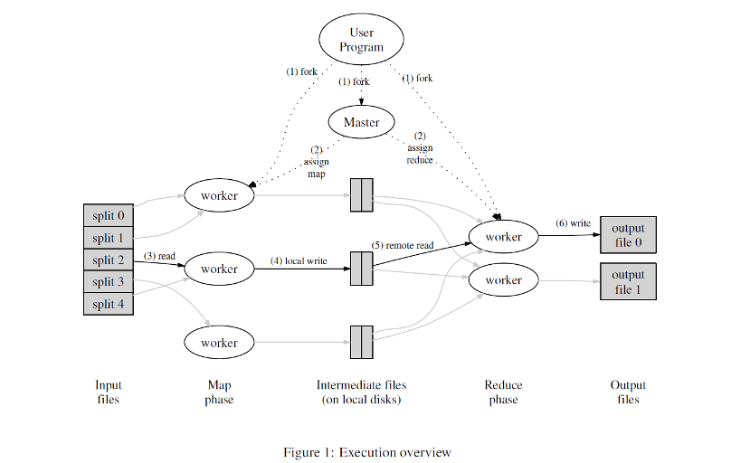

## 第24章 Hadoop MR

### 一、组成

- Map Reduce：作业调度
- HDFS：分布式的文件系统
- HBase：数据库
- Hive：数据仓库

### 二、MapReduce

- 输入文件非常大，如下图分成几个split分片。假设我们现在要审查这个里面是否有少儿不宜的镜头还有恐怖的镜头。
- 假设我们找三个人来看，如下图所示的三个worker。由于电影片头片尾可能内容不一样，三个人不会同时看完，也就是说他们的进度会有所差异。
- Master是HadoopMR的核心，负责分配任务，看得快的人看完了Master就会再分配任务，如果有机器寄了偷懒不干活了，Master就会重新把他的任务分配给活着的机器。（Master不断的发心跳包）
- 三个worker会分别把恐怖的镜头放在自己存储的一个地方，少儿不宜的镜头放在另外一个地方。也就是把看的中间结果存储。
- 接下来就是shuffle操作，恐怖的镜头都会传给一个worker来进行处理，少儿不宜的镜头都会传给另外的一个worker来进行处理。
- 最终的两个worker会把前面的三个worker产生的恐怖的所有镜头合并，产生一个输出，所有的少儿不宜的镜头合并然后产生一个输出。
- Map Reduce中的Map定义是：把输入映射成输出，每个机器不会管别的输入，只会管自己的输入部分，把输入结果产生中间结果。Reduce负责合并的部分，把所有的中间结果合并，得到最终的输出。

### 三、具体例子，统计单词

- 假设有两个文件，第一个文件：`hello,world`，第二个文件：`hello,java`
- 假设有两个worker，第一个worker读取之后，map阶段产生`[hello,1]`，`[world,1]`，第二个worker读取之后，产生`[hello,1]`，`[java,1]`
- 然后就是combine合并阶段，HadoopMR会自动归并相同的key，生成`[hello,[1,1]]`，`[world,1]`，`[java,1]`，为啥不直接生成求和之后的结果呢，因为具体的业务逻辑应该给用户决定，这次是求和，下次可能就是求平均或者最大值。
- 然后就是shuffle阶段，可能规定把key是hello的发给第三个worker做reduce，key不是hello的发给第四个worker做reduce。
- 然后会排个序
- 最后是reduce阶段，生成`[hello,2]`，`[world,1]`，`[java,1]`，结束。

### 四、mapper

- mapper的数量跟block一样，多少个block就是多少个mapper（一个block默认64MB）
- reduceer的数量：0.95 or 1.75 multiplied by (<*no. of nodes*> * <*no. of maximum containers per node*>).
- 使用0.95时，所有reduce都可以立即启动，并在map完成时开始传输map输出。（弄少一点，每个reducer都做一点，把所有的撒出去，完成时间取决于最长完成的一个机器）
- 使用1.75，速度更快的节点将完成第一轮reduce，并启动第二轮reduce，从而更好地完成负载平衡。（把所有的任务切小，弄多一点数量，每个reducer都少做一点，做完再分配，好处就是每个速度很快短小）

### 五、优点缺点

优点：

- 适合PB级以上海量数据的离线处理
- 高容错性：其中一台机器挂了，它可以把上面的计算任务转移到另外一个节点上运行，不至于这个任务运行失败，而且这个过程不需要人工参与，而完全是由Hadoop内部完成的。
- 良好的拓展性：通过简单的增加机器来扩展它的计算能力
- 易于编程：它简单的实现一些接口，就可以完成一个分布式程序

缺点：

- 频繁的读写硬盘，每次计算的中间结果都会落到硬盘上保持，这样换来了可靠性但是丢失了效率
- 大量的时间被浪费在读写硬盘上面，所以提出来一种新的方法就是Spark，把所有的操作放在内存里面
- 不擅长实时计算或者说流式计算，MapReduce的输入数据集是静态的，不能动态变化

最后说一下Yarn的特点

- 全局有一个资源管理器
- 当资源不够的时候，或者等待的任务过多的时候，ApplicationMaster就会向资源管理器发出请求，请求增加资源。

- 实现了资源管理器和任务调度管理分开

