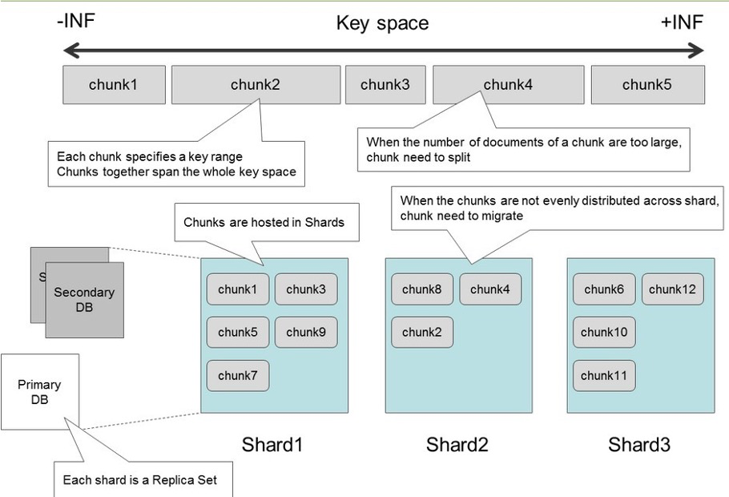

## 第19章 MongoDB

### 一、NoSQL

- NoSQL是指Not Only SQL
- 举例Neo4j存储的是图数据，图数据库比较适合查找一个节点附近的相关的节点，比如查找距离为2的节点
- Influxdb是存储的时序数据，比如有一个温度传感器，他就会根据传感器数据进行记录。数据非常简单由时间戳和数据组成

- MongoDB数据的结构化程度不太好，在SQL的数据里面可以画出二维的表格，但是结构性不好的时候就需要MongoDB类似的非结构化数据库

### 二、DAO和Repository差异

- 一般来说，一个Repository对应的一个类型的数据库里面的一个表，
- DAO的任务是需要屏蔽不同数据库差异，让服务层的眼里只有一个一个的对象。比如对于“用户”，用户的头像可能存在MongoDB，其他的用户名邮箱存在SQL里面，DAO就要完成组装。

### 三、MongoDB特点

- 以文档为核心，数据的基本单元急速 document。所有的内容都是json的对象，key-value对
- 关系型数据库的一个表就相当于一个collection
- 支持Map Reduce
- 模式自由
- 权限控制，每个数据库存储在单独的文件
- 支持地理空间索引

### 四、MongoDB的自动Sharding

- Sharding指的是分片，MongoDB支持自动分片
- 假如一个collection比较大，他就会把collection切成几个block（chunks），把这些block分布到多台机器上面存储
- 此外MongoDB会自动保证不同的机器之间，block的数量差异小于等于2
- 分区之后，还有一些配置的元数据需要记录，在config配置服务器存储，它相当于一个路由器，针对访问的请求结合元数据，把请求转发到对应的分片存储的数据服务器来获得结果
- 这样的好处就是存储的压力比较平衡，当然也支持人工的管理，因为有时候数据的冷热有差差别，数据访问的频率有差别，这种情况就会手动分片，把一些经常访问的数据均衡放置，因此这种情况下，可能某一台机器存储的大小比较大，不同机器之间block数量的差距可能超过了2（**为什么有时候也需要人工管理sharding分片**）

### 五、shard的依据

- 需要选择一列，作为一个key，这个key就叫做shard key
- 例如A-F开头学生姓名作为一个分片
- 例如G-P开头学生姓名作为一个分片
- 例如Q-Z开头学生姓名作为一个分片

### 五、什么时候sharding

- 通常情况下默认不会是sharding的
- 当前计算机上的磁盘空间已用完。
- 您希望写入数据的速度快于单个mongod所能处理的速度。（比如大量的传感器往数据库1s可能要写入1GB的数据，如果来不及写，就需要多个MongoDB来写入）
- 您希望在内存中保留更大比例的数据以提高性能，分布式缓存

### 六、超容量处理

如下图所示：

- 假设开始的时候分片，每个chunk代表的是某一个范围的数据，chunk就会被分布式的存储在shard服务器里面
- 当往一个chunk里面不断插入数据的时候，这个chunk可能就会分裂，分裂成多个chunk。
- 考虑到前面所说的不同的shard服务器之间chunk的数量差异不能超过2个，那么一旦分裂之后数量违反了这个规定，MongoDB就会自动的调整chunk在服务器之间的位置，保证均衡。

<!--  -->