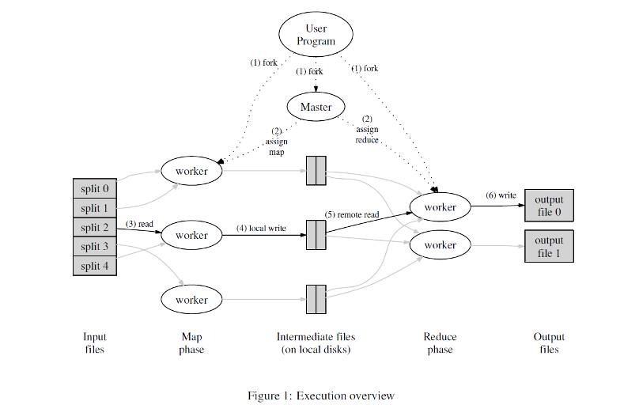

### 应用系统体系结构

[TOC]


#### 第3章 Message

##### 一、同步客户端-服务器模型缺点

- 最早的通信全部都是同步的的通信，比如系统A和系统B之间通信，需要两个系统提供API
- 同步的通信需要客户端一直等待相应，需要等很久可能
- 当需要通讯的模块多了之后，不然四五个通讯系统的时候都要交互的时候，比如A系统要对B、C、D都开发一套API，这很麻烦。API的数量会大量增加
- 紧耦合，一旦有一个地方的函数参数或者返回类型要修改，大量的代码都需要修改，非常麻烦。
- 假如有一个系统暂时挂掉了，能不能反复多尝试几次呢，传统的方法不行。
- 通讯不可靠，过于依赖请求响应的模式。
- 没有缓冲区。

##### 二、异步的优点

- 在所有的系统里面有一个通讯的媒介，系统不直接交互，而是通过中介来通讯。
- 系统之间约定统一的通讯模式，topic相当于信箱，每次通讯的时候就把信息往信箱里面发，然后另外一个系统可能会监听这个信箱，一旦有新的内容接受，就开始处理
- 站在Kafka消息中间件的角度，所有系统都是对等的，不存在客户端-服务器的模型，所有的系统都可以收发信息。
- 实现解耦，哪怕有一个系统崩了，消息中间件会多次发送

#### 第4章 Kafka

##### 一、原理

- kafka的数据存储在log里面，数据往文件后面不断追加，追加的速度更快，如果是随机访问反而效率低
- log里面都是有序的事件，每个事件都有位移，偏移量
- 当然有很多个消费者，把消费者分成不同的组。当一个消息被所有的消费者读走了之后，这个消息才会被删除掉。
- 这样就能保证log文件不可能无限制的增长。

##### 二、数据类型

- Topic里面存储的都是同构的数据类型，数据类型统一（访问效率高，推导出偏移量为X的时候直接就可以推出）
- Topic里面存储的都是异构的数据类型，数据类型不一样（访问效率低，不好推出某个偏移量的消息）
- Topic可能会分成几个Partition，假设某个Topic非常大，就可以分区。最终会使用某种hash算法，kafka自己会决定放到哪一个具体的区域里面。
- 分的区域越多，管理的复杂性增加，但是并行处理，也增加了处理的效率。
- 卡夫卡的消息（event）是一个带有时间戳的key-value对，他会记录一些发生的事情。key可以作为分类的依据，value最好不要作为分类的依据。此外，key也不是必须的，value

##### 三、集群的容灾

- 用空间换可靠性，比如每个数据存储两个副本，这样比如有一个卡夫卡服务器崩溃了，还有一个备份能够使用
- 需要一个协调器在卡夫卡集群里面，比如有多个消费者订阅了集群的topic，他们都在处理topic里面的内容。consume会不断的给协调器发心跳包，表明自己正在处理，如果某个consumer不发了说明故障了，协调器就不会把消息发给故障的。

#### 第5章 WebSocket

##### 一、背景

三种方法展示订单处理的前端

1) 在前端工程中，使用JavaScript监听订单处理结果消息发送到的Topic，然后刷新页面；

2) 在前端发送Ajax请求获取订单的最新状态，后端接收到请求后将订单状态返回给前端去显示；

3) 采用WebSocket 方式，后端的消息监听器类监听到消息处理结果Topic 中的消息后，通过WebSocket发送给前端；

- **使用JavaScript监听的优缺点分析：**
  - 优点就是直接交互，简洁明了，降低了后端Spring的压力(不需要单独写一个接口，单独运行相关的Kafuka查询组件的信息)。
  - 缺点也是直接交互，使用JS监听，相当于用户客户端直接和信箱交互，这就会导致我的卡夫卡Topic信箱直接暴露，我认为这是一个不好、不安全的方式。卡夫卡信箱里面涉及到用户的订单数据，所以使用后端直接交互，然后后端Spring暴露访问接口，更加安全。
- **使用Ajax轮询的方式优缺点分析：**
  - 相比较于上个方法JS直接跟Topic信箱交互，这个不安全，所以Ajax轮询的话，单独有一个查询接口（还可以增加鉴权），所以比较安全
  - 缺点相比较于上个JS直接交互的方法，这个是间接交互，所以消耗资源，更耗时间。

- WebSocket是一种主动的方式，后端可以主动的把结果推送给前端的客户端，而不需要前段通过定时设定，然后来不断的查询我们的订单结果。这就类比我们课上讲过的改作业，下订单就好比学生把作业交给老师（服务器），服务器改完作业主动通知学生来拿，如果采用的是1或者2的方法，需要学生每隔一段时间就来询问老师作业是否改完了，这浪费并且消耗了连接和资源，是一种不合理的方式，所以我这里果断弃用了前面的两种。归结来说三个优点

  - **推送功能**：支持服务器端向客户端推送功能。服务器可以直接发送数据而不用等待客户端的请求。

  - **减少通信量**：只要建立起websocket连接，就一直保持连接，在此期间可以源源不断的传送消息，直到关闭请求。也就避免了HTTP的非状态性。和http相比，不但每次连接时的总开销减少了，而且websocket的首部信息量也小 ，通信量也减少了。

  - **减少资源消耗**：如果用AJax轮询的话，我们需要专门设置一个接口，运行相关的查询代码，而且由于前端是定时的不断的发请求来查询，相关的查询结果的代码要运行很多次，这浪费了资源，反而如果只用WebSocket，推送代码只用运行一次。

  - 但是也有缺点：比如需要浏览器支持WebSocket，例如我的Safari浏览器在WebSocket的测试中出现了一些问题（由于一些安全性的原因，但是Edge浏览器就可以正常保证WebSocket的连接），同时如果只是单页面涉及到WebSocket还好，涉及到多页面，定时推送，复杂的推送，就非常容易出问题了，不管是前端，还是后端都会遇到一些问题。

##### 二、WebSocket

- 客户端向服务器发一个http的GET请求，发的时候要说明upgrade，马上要升级为ws链接，同时会发送一个key
- 服务器返回http的相应，101，切换协议，返回的时候会附带一个accept
- 客户端用相同的算法，把原来的经过计算后，看看服务器发回来的跟自己计算的是不是一样

#### 第6章 多线程

##### 一、定义

- 进程：有独立的内存空间
- 线程：线程有时被称为轻量级进程。进程和线程都提供了一个执行环境，但创建新线程所需的资源比创建新进程少。线程存在于一个进程中-每个进程至少有一个线程。线程共享进程的资源，包括内存和打开的文件。这有助于通讯高效但可能存在潜在的问题。

##### 二、创建线程

- 方法一：手动创建一个线程，这个线程执行完就结束了。（人为的管理、控制线程）
  - 一种方法是继承Thread类
  - 一种方法是实现Runnable（推荐使用和这个，因为java里面只能继承一个类，但是实现可以实现多个类，所以珍贵的资源继承应该让出去，这也是官方推荐的方法）
- 方法二：通过线程池，如果有需要获取线程就在池子里面找一个，用完之后收回，还是放在在线程池里面。节约资源，因为创建线程的时候需要消耗资源。（不需要考虑线程的管理，线程是新创建的还是已有的使用者不需要知道，由线程池管理）

##### 三、多线程问题

- 线程干涉：（两个线程都在写）A线程写入之后，B线程再次写入，然后导致A写的丢失了，这就是线程干涉
- 内存不一致：（一个线程在写，一个线程在读）当不同线程对应该是相同数据的看到的不一致时，就会发生内存一致性错误。避免内存一致性错误的关键是理解先发生后发生的关系。这种关系只是保证一个特定语句的内存写入对另一个特定的语句可见。（总之就是不能线程交替读和写，要目专门读，要目专门写）

##### 四、解决办法

- 解决方法：`Synchronized` 同步修饰函数名(假设有一个线程在调用第一个方法，其他所有的线程都不能调用下面类里面的三个方法！注意是三个函数只要有一个在被调用，剩下的包括自己就都不允许其他的线程调用)【原理：这个对象有一个内部的锁，而执行的前提是要获取这个锁】【问题：静态方法会不会出问题？不会，因为每一个静态方法和类关联而不是一个对象，其实类还和一个class Object相关联，所以即使是静态方法也适用】

  ```java
  public class SynchronizedCounter {
      private int c = 0;
      public synchronized void increment() { c++; } 
      public synchronized void decrement() { c--; } 
      public synchronized int value() { return c; } 
  }
  ```

- 当然也可以把粒度放小，

  ```java
  public void addName(String name) {
    synchronized(this) {
      lastName = name;
      nameCount++; 
    } 
    nameList.add(name); 
  }
  ```

- 原子变量（加一个volatile修饰就可以了）：前提是这个变量很容易出现内存一致性错误的问题，就需要加一个原子变量，这样编译器就会识别，保证这个变量的线程安全。但是不要把所有的变量都变成原子变量，这样会降低性能，矫枉过正。

- 死锁：A线程等待B，B等待A，这样就会陷入死锁的循环。

- 饿死：A想要访问一个共享资源，但是一直获取不到，就像被饿死了一样。（池化的方式，需要消除那些贪婪的线程，避免一个线程c长期贪婪的占用连接，）

- 活锁：假设有AB两个线程，A产生数据发给B，如果A产生的数据特别多，导致B无法处理，传来的数据太多了导致B忙不来，也就是A得不到响应或者回复答复。

##### 五、不可变对象

- 推荐使用不可变对象，定义是：如果对象在构造后其状态不能改变，则该对象被认为是不可变的。最大程度地依赖不可变对象被广泛接受为创建简单、可靠代码的可靠策略。不可变对象在并发应用程序中特别有用。因为它们不能改变状态，所以它们不能被线程干扰破坏或在不一致的状态下观察到。
- 不可变对象的话那我想要修改怎么办？创建一个新对象
- 为什么需要不可变对象：线程干涉是因为（两个线程都在写W/W）,内存不一致是因为一个在写一个在读（W/R）,如果我们禁止掉写操作，就避免了这个问题。
- 缺点：创建新对象的代价很大，但是其实Java的JVM让这个代价不是很大

为什么要选择线程安全的集合类型来维护客户端 Session？

如果有⼤量的⽤户（或者说客户端进⼊到Websocket连接），那么这个时候要做的动作就是把Session放⼊⼀个集合中【我⽤的集合是ConcurrentHashMap】，也就是在往集合⾥⾯写⼊内容，如果不能保证线程安全，由于在往集合中写⼊内容这⼀个操作不是原⼦操作，甚⾄涉及到很多复杂的过程，也就是说这些线程直接会相互⼲扰影响（我们可以举⼀个最简单的例⼦，哪怕i++这⼀⾏代码从汇编来看都涉及到三个操作，从内存拷⻉、⾃加、然后复制回去内存），最终导致的结果就是：可能同时有100个⽤户涌⼊进来，但是由于线程之间的⼲扰，最终能够维持的Session就只有80或者90多个，会有遗漏。为此，我们需要使⽤线程安全的集合来维护Sessions集合。

##### 六、线程池

- 执行器就是一个线程池，包含很多线程，线程池以池的方式进行管理
- 使用工作线程可以最大限度地减少线程创建带来的开销。一种常见的线程池类型是固定数量线程池（没有创建线程的开销）。这种类型的池始终有指定数量的线程在运行。固定线程池的一个重要优点是，使用它的应用程序可以优雅地降级（我写的代码崩溃了但是不会影响线程池，独立的）。
- 创建使用固定线程池的执行器的简单方法是调用java.util.concurrent.Executors中的newFixedThreadPool工厂方法此类还提供以下工厂方法：newCachedThreadPool方法创建具有可扩展线程池的执行器。此执行器适用于启动许多短期任务的应用程序。newSingleThreadExecutor方法创建一个执行器，一次执行一个任务。

#### 第7章 安全

##### 一、签名、摘要、数字证书

下面的逻辑是层层递进的，黑色的字体代表不合理的地方以及下一代改进的原因。

- 下载到的js代码怎么知道是否应该执行这个脚本，这些文本经过网络传输怎么知道来源于合法网站，且传输的过程里面没有经过第三方的篡改？
- 摘要：一块数据生成的一个电子指纹，例如SHA1（hash散列），无论是多大多小的输入数据，通过计算出来都是一个20字节的数据。特点就是：哪怕修改输入数据里面的一个比特，整个计算出的摘要值，都会发生巨大的变化。想要伪造出一个和原来消息相同的摘要值的难度是非常大的，可能性是2的60次方，几乎不可能。因此通过摘要就能防止消息在传递的时候被篡改。**假如摘要和传递目标消息一块传递，因为摘要的一些算法都是公开的，假如被截获了，截获者单独的用算法算出来一个新的摘要值，那就达不到效果。所以摘要需要单独传递，并且保证不可篡改，因此就有了签名。**
- 数字签名：摘要经过加密，就得到数字签名。签名要用到公钥、私钥对，生成这种公钥私钥对有很多算法，用公钥加密的东西只能用私钥解密、私钥加密的东西只能公钥解密。根据公钥无法计算出私钥。总之公钥是公开的，给谁都可以给的，但是私钥是留给自己的，打死不能给的。这样就保证了传递的可靠性。用私钥加密，然后分发出去，客户用公钥解密。**但是，假如公钥传递的途中被截获篡改，有人修改了怎么办？证书应运而生。**
- 数字证书：数字证书里有个重要概念，CA,发送方先把自己的公钥给CA，CA对其进行加密得到加密后的发送方公钥（用的是CA的私钥和CA加密算法），也就是CA的数字证书。接收方拿到后，首先从数字证书中解密出发送方公钥（用的是CA的公钥和CA解密算法），这个公钥必然是可信的。然后就是和前面一样的流程，拿发送方公钥去解密数字证书，得到摘要；最后比对摘要是否一致。**怎么保证“CA”的公钥不是伪造的呢？CA的公钥是公开的，甚至刻在浏览器系统里面的。**

##### 二、加密

- 非对称加密用的是一对秘钥，分别叫做公钥（public key）和私钥（private key），也叫非对称秘钥。非对称秘钥既可以用于加密还可以用于认证。（性能一般比较差，但是比较安全）
- 对称加密：加密和解密用的是同一个密码或者同一套逻辑的加密方式。我们平时碰到的绝大多数加密就是对称加密，比如：指纹解锁，PIN 码锁，保险箱密码锁，账号密码等都是使用了对称加密。（性能一般比较好，速度快，但是存在的问题就是key加密的问题）

##### 三、SSL

- TLS：传输层安全,SSL：安全套接字
- 具体流程：当用户访问https的网站时候，服务器用公钥产生一个加密过的内容，浏览器用CA的公钥解开，得到服务器端的公钥，然后之后用户和网站的所有通信都会用密钥加密，保证安全。

**HTTPS 通信方式与HTTP 通信方式的差异：**

- HTTP是明文传输内容的，可能会被截获，不安全。HTTPs的传输内容经过了公钥的加密，所以更安全。
- 默认的端口不一样，HTTP默认端口80，HTTPS默认443，对应后端的分别是8080和8443端口
- 使用 HTTPS 协议需要到 CA（Certificate Authority，数字证书认证机构） 申请证书，一般免费证书较少，因而需要一定费用。证书颁发机构如：Symantec、Comodo、GoDaddy 和 GlobalSign 等。
- HTTPS 其实就是建构在 SSL/TLS 之上的 HTTP 协议，所以，要比较 HTTPS 比 HTTP 要更耗费服务器资源。

#### 第8章 jwt与SSO

##### 一、JWT

- JWT就是JSON WEB Token，是一个开放标准（RFC 7519），它定义了一种紧凑且自包含的方式，用于将信息作为JSON对象在各方之间安全地传输。此信息可以被验证和信任，因为它是数字签名的。JWT可以使用秘密（使用HMAC算法）或使用RSA或ECDSA的公钥/私钥对进行签名。
- 组成：
  - Header：消息头，可能包括："alg": "HS256","typ": "JWT" 
  - Payload：载荷，iss (issuer), exp (expiration time), sub (subject), aud (audience), and others.
  - Signature：签名：根据前面的内容还有服务端的私钥签名，然后客户端就可以用公钥来验签，判断内容是否被更改过
- Base64编码：64是2的6次嘛，把要传输的文本用比特流表示出来，然后每六个一组，做一个转换，这样得到就是大小写的字母、点问号或者之类组成的纯文本。这些字符在网络上传输都是没有问题。因为一些历史渊源，一些传输协议在阐述高于128，也就是一个Byte的第一位为1的时候，一些传输协议可能会把它截断了，这就导致传输会出问题，但是base64就比较靠谱，保证传输的可靠性。

##### 二、单点登录

- 降低网络钓鱼的成功率，因为用户没有经过培训，可以不经思考就到处输入密码。
- 减少不同用户名和密码组合的密码疲劳
- 减少为同一身份重新输入密码所花费的时间
- 由于减少了IT服务台关于密码的呼叫次数，从而降低了IT成本
- 所有级别的进入/退出/访问系统的安全性，无需重新提示用户
- 集中报告以实现法规遵从性。

##### 三、Kerberos

- 用户单点登录的时候输入用户名密码，客户端针对密码进行哈希算法，得到一个密钥，这就是后面用来解密的secret key（注意以上操作都在客户端进行的！没有经过网络）
- 然后客户端发送一个明文的：包含用户名，发给AS（认证服务器）【注意：刚刚的密钥还有用户输入的密码没有发走，不经过网络传输非常安全】
- 然后AS（认证服务器）产生密钥，通过数据库找到的用户的密码hash一下，得到secret key
- 然后AS（认证服务器）给客户端发两个东西
  - Message A: 客户端和授权服务器（TGS）之间的通讯的session Key密钥，使用刚刚数据库找到的用户的密码hash一下，得到的secret key，进行加密。加密的结果就是Message A。客户端收到了Message A会用本地根据用户输入的密码计算的secret key来在本地解密，如果用户密码输入正确解密就成功，如果用户密码输入错误就无法解密Message A。
  - Message B:  使用TGS的密钥加密刚刚的A中的session Key密钥，作为Message B发给客户。客户拿到B之后什么都做不了，不能篡改。（为什么要一个B消息？因为TGS服务器需要防止客户自己随便发了一个session Key，所以需要客户端发来的Message B，用自己的TGS Key解密，解密成功就说明用户是可靠的经过认证的，反之就是伪造的）
- 然后客户端发送下面两个消息给TGS
  - Message C：组合message B和请求的服务资源 
  - Message D：一些敏感信息：客户端是谁、时间戳，使用TGS session Key来进行加密
- 然后TGS收到了C和D消息，TGS从C消息里面拿出B消息，使用TGS私钥解密，得到的客户端的TGS session Key，然后用这个Key解密Message D。到此为止客户端和TGS的都有了session key，可以进行加密通信。TGS接下来又会给客户端发Message E和Message F。
  - Message E：包括client ID, client network address, validity period和Client/Server Session Key，使用服务端Server的私钥（这个是以后客户端跟Server通讯的凭据，因为使用的Server的私钥加密，所以客户端无法解密）
  - Message F:  Client/Server Session Key 使用 Client/TGS Session Key加密（这个客户端可以解密）
- 接下来的事情就是：客户端和服务端Server通讯，例如某个单点登录的应用
- 客户端收到E、F，再向服务端Server发下面的两个消息
  - Message E：客户端无法解密只能原封不动的发走
  - Message G：把自己是谁 client ID, timestamp使用 Client/Server Session Key加密（Client/Server Session Key是从上一步的Message F解密得到的）
- 服务端Server收到了之后，就用自己的私钥解密Message E和G，就得到了E里面蕴含的Client/Server Session Key，然后这个 Session Key也可以解密Message G
- 从此，客户端和Server就通过Session Key可以通讯

##### 四、单点登录的缺陷

- 单点故障：类比jaccount要是故障，所有系统无法登陆
- 传递的过程对于时间很敏感，一旦过期就无效
- 管理层的实现没有特别交代，具体实现取决于用户
- 一旦被攻击，所有的用户信息全部丢失
- 如果都是一个公司或者企业，例如交大sjtu.edu.cn的后缀都是一样的还比较好，但是如果跨越的范围比较广就不太适合

##### 五、CAS的优点

- 多个CAS服务器集群，一旦出现崩溃，负载均衡会把请求发给存货服务器
- 读写分离并且备份
- Ticket Storage多服务器备份，大大增加可靠性

#### 第9章 缓存和Redis

##### 一、为什么缓存

- 常见的一个问题是：数据库里面有buffer、ORM映射里面也有buffer作为缓冲区，那为什么要缓存呢？
- 上面说的这两个缓存都不是你可以控制的，完全取决于他们自身，我们开发者管不了
- 而使用redis，我就可以自己的控制缓存，非常好
- 数据库里面的数据是表格，表格的对象经过ORM映射拿了过来好不容易转化为java对象，我为什么不把他存起来呢？这样还可以节省开销
- 上面说的是数据库，假如我还有从文件系统里面读取的，nosql数据库里面的读取的东西、动态生成的网页、图片都可以 ，所以使用redis就都可以存储，redis完全在开发者的控制下。比如甚至双十一的时候，我可以趁用户访问量少的时候提前把可能卖爆的网页缓存出来，这样提高访问的速度
- redis甚至还可以作为消息中间件，类似kafka的topic，他和卡夫卡的差别是redis里面的东西在内存里面

- 数据库服务器对于内存要求比较高，而Tomcat服务器主要是CPU密集型，对于一些只读的数据，我从数据库拿到之后就缓存在本地，这样就可以更快的拿得到！

##### 二、一致性哈希

- 把hash的结果作为一个0-很大的数字，这些数字成环分布
- 假想服务器放在这个这个环里面的几个节点，0代表环的开始，当计算的结果为0-服务器1的值的时候，放在服务器1，服务器1-服务器2的值的时候放在服务器2，这样围一个环
- 假如要在服务器1和2之间，添加一个服务器1.5，那么原先计算的结果在服务器1-服务器1.5之间的数据就要迁移到服务器1.5上面，剩下的数据保持不变

##### 三、redis

- nosql数据库，内存型数据库
- 可以有主从备份、集群化部署，
- 什么东西放缓存：按照上课讲的，那就是：
  - 经常用到的东西
  - 经常涉及到读取操作的，而很少涉及到写的操作的
  - 中间计算的结果
  - 经常要写的东西不要放入缓存

##### 四、分布式缓存

- 为什么需要分布式缓存：因为一个机器的缓存可能不够，物理上多个机器，实际逻辑上是一个大的缓存，可以充分利用多个机器的内存
- 稳定可以备份，可靠性增加

#### 第10章 全文搜索

##### 一、什么是全文搜索

- 类似百度的网站，用户搜索一个关键词，根据建立的索引，查找包括关键词的相关的非结构化的数据里面有哪些包含目标关键词。
- 为什么数据库也可以搜索啊？效率低，如果在数据库里面查询，需要几乎经过全表查询，把所有的内容全部读取一遍，这样的效率非常低，二建立索引之后就可以更快的找到目标
- 所以我们需要建立一个索引，提高效率，让搜索变快！

##### 二、建立索引

- Parser：解析数据，数据可能是html、pdf、word文档，使用相关的parser解析
- Analysis：分析token，比如有些单词是take、took、taken都是take的不同形式，需要做一个归类
- 然后根据规则，建立索引，这样就可以根据索引查询了

##### 三、索引和反向索引

- 正向索引：正排表是以文档的ID为关键字，表中记录文档中每个字的位置信息，查找时扫描表中每个文档中字的信息直到找出所有包含查询关键字的文档。尽管**正排表的工作原理非常的简单**，但是由于其检索效率太低，除非在特定情况下，否则实用性价值不大。
- **反向索引（倒排索引）**：倒排表以字或词为关键字进行索引，表中关键字所对应的记录表项记录了出现这个字或词的所有文档，一个表项就是一个字表段，它记录该文档的ID和字符在该文档中出现的位置情况。由于每个字或词对应的文档数量在动态变化，所以倒排表的建立和维护都较为复杂，但是在查询的时候由于可以一次得到查询关键字所对应的所有文档，所以效率高于正排表。

##### 四、Field

- 每个字段对应于在搜索期间根据索引查询或从索引检索的一段数据。
- Keyword：关键字不被分析（就是不会被拆开），而是被索引并逐字存储在索引中。
- UnIndexed：既不分析也不索引，但其值按原样存储在索引中。也就是说一旦假如通过keyword查询到了，要把unindex的部分的内容要带出来，但是这部分不索引。
- UnStored：此字段类型被分析和索引，但不存储在索引中。当然他有一些停用词列表，比如都共有的词。一般是正文，非常长不应该存在索引里面，非常浪费。
- Text：被分析并被索引，存储到索引里面。这意味着可以针对这种类型的字段进行搜索，但要注意字段大小。可以类比keyword，区别是这个text会被分析一下，而keyword不会
- 综上，以上filed保证索引的大小！

#### 第11章 Web服务

##### 一、WebService概念

- Web指的是web协议，例如Http、FTP、SMTP（web协议适用领域广，传递纯文本）不能用一些RPC远程调用的协议。使用Web协议的好处是突破访问的限制，让更广阔的区域的人能够访问得到。（所以，比如一个网络文件系统既可以通过http的协议，也可以通过ftp的协议访问）
- 服务：独立于具体的实现：Service解决的是异构的问题（操作系统、编程语言的差异），比如客户端是C#开发的，服务端是java开发的，那为了方便他们之间的交互，我们就要走纯文本的路线大家都能认识的。既然是纯文本，那需要一定的格式，SOAP传的数据里面包括了一系列的operation、参数的名称类型，但是数据驱动型的。

##### 二、SOAP

- SOAP指的是简单对象访问协议，针对API纯文本化传递，例如规定传递XML的格式
- WSDL：一个自描述的文件，把接口描述成xml的形式（只能XML），这个文件不需要自己写，通过工具生成。会根据接口、参数类型、参数顺序、接口返回的参数类型，全部用xml来表述出来。此外会把operation、服务所在的URL接口的名字写出来。
- binding是什么呢？比如一个webService可以通过http和ftp，那就有两个binding，类比老师接受答疑，可以通过腾讯会议也可以通过电话。

举例：

- 一个Java程序访问一个c#扣款的服务：
- 那么这个java程序就需要把c#扣款的服务的wsdl文件给拿过来
- 根据wsdl文件生成java语言的接口
- java程序调用接口，里面有一些操作可以调用，调用之后就可以经过一个proxy代理，翻译成一个soap消息发送到c#扣款的服务
- c#扣款的服务接收到soap消息，也是先被一个proxy代理拦截，把soap消息翻译成c#然后调用具体的业务逻辑。产生结果后，又返回给proxy代理，组装成一个soap消息，作为调用结果返回
- java端的proxy接收到soap消息，翻译成java的返回结果。
- java端成功的获取到返回结果

##### 三、SOAP的缺点

- 需要一个WSDL的文件，里面需要描述消息传递的格式，有一个外挂文件的方式总的来说是不好，需要额外的东西。
- 反复组装和解析SOAP需要消耗大量的时间，性能不太好，需要经过很多的翻译
- 客户端、服务端和API耦合，一旦API发生变化（比如下单参数从四个变成五个），那么WSDL文件就要发生变化，服务端客户端代码都需要重新生成，需要消耗时间资源（代码可维护性变差）
- 因此我们需要数据驱动型的方式来，Restful Web Service应运而生

##### 四、Restful Web Service

- 含义：Representational表述性，State状态，Transfer转移，全名表述性状态转移
- 表述性：所有的数据都是资源(通过设计URL然后来表示数据，客户端用来展示数据)，每一个资源都有自己的表示方式，有自己的URI
- 状态：指的是客户端的状态，客户端维护自己的状态，服务器是无状态的（避免维护客户端的状态，需要消耗内存资源）客户端自己保存cookie或者localstorage，资源的表示就是客户端的状态
- 转移：客户端从一个页面跳到另一个页面，一种表示跳到另一种表示，客户端的表示可以发生迁移。迁移的过程中，客户端只把数据请求回来，然后呈现出来，客户端的页面然后就发生了变化，这就是所谓的表述性状态转移
- Restful Web Service特点：
  - 典型的客户端、服务端架构，但是是无状态的
  - 客户端和服务端之间传递的都是数据
  - 服务端只处理数据，数据的展示完全依赖于客户端
  - Rest是幂等的
  - 通过URL设计，Get方法对应读、POST代表创建、PUT代表更新、DELETE代表删除，四个HTTP方法严格对应增删改查
  - 通过Http的返回码表示返回的结果，比如201成功，404代表不存在，500代表服务器内部的错误。

##### 五、WebService的优点缺点

- 优点是跨平台，基于XML，json等等
- 自描述：WSDL就是一个自描述文件，里面包括了一系列的操作，Restful的话就是完全基于URL
- 模块化好，封装的好，不需要关系具体的实现
- 区域访问性质广，可以穿透防火墙

- 缺点是：写代码的效率低，不适合stand-alone应用，soap显然比之间rpc效率低，rest因为传递的是纯数据，数据的解析需要消耗一定的资源
- 性能有一定的降低了：需要把java对象转化为一个纯文本的，或者解析文本作为一个java对象
- 安全性，因为webService的地域性广，就比较容易受到攻击，或者中间人截获了。

##### 六、什么时候用web Service

- 支持跨防火墙的通讯、支持跨防火墙的通信、支持应用集成、支持B2B集成、鼓励重用软件
- 不应该使用WS时：独立应用程序、如MS Office、局域网中的同构应用：例如COM+或EJB之间的通信（再比如spring访问mysql、redis、kafka、elasticSearch）

##### 七、SOA

- SOA指的是Service-oriented architecture （面向服务的架构）
- 假如我要构建一个电子书店、里面包括了认证登录系统、财务系统、统计系统、订单系统，这么多系统开发下来很复杂，而且假如我是卖家，卖给了1000个新华书店的用户，然后突然发现某个系统存在漏洞，就要告诉一千个用户，这很麻烦
- 所以就有一个新方法、登录系统用第三方的比如百度的，订单系统用第三方的，然后我自己就只做一个集成。如果发现登录系统有bug，就告诉百度的问题，这样就可以快速构建一个应用，节约开发成本
- 特点：1、 服务之间松散耦合，也就是是登录系统、财务系统、统计系统、订单系统这些系统通过我开发的中间件联系，而不是之间直接互相通信，这样的好处就是假如我发现登录系统不好或者太贵了，我可以换一下，换之后别的系统也不会受到影响。2、位置透明，中介者负责路由，3、协议独立，从http切换到ftp，但是不要让客户端来实现

#### 第12章 微服务

##### 一、什么是微服务

- 我们构建的不是一个完整的系统，而是多个小的、自包含、互不干扰的（比如一个崩溃了不干扰另外一个系统）小模块构成。每个小模块都可以单独的独立的运行。这样就使得我们的代码有弹性
- 总之微服务就是把一个大型的应用切分成几个小的应用模块，每个块都独立与其他的服务。
- 为什么用微服务：便于维护（单个服务器出问题了针对性解决，而不需要把所有的服务停机）、彼此隔离（微服务的每个小模块之间彼此隔离不影响）、提高生产力（彼此之间没有直接交互，不会影响性能）、更高的容错性（一个坏了别的不会坏）、更好的业务提供（容错性好也保证服务的稳定性）
- 前端不需要硬编码，只需要写明网关，这样我微服务集群里面哪怕一个机器崩了，把相关服务迁移到另一个机器，IP地址、端口什么的都改变了，前端代码不需要改变，因为GateWay会处理转发。
- 缺点：1、如果GateWay崩溃了那么就有些困难，所有的服务全部崩溃；2、成本增加，运维的复杂度增加，原先所有的都在一个机器上，但是现在可能变成了多个机器；

##### 二、各部分的作用解释

- GateWay：作为一个统一访问的网关。应用程序（前端）不需要知道具体的是哪个服务器处理对应的服务，只需要对GateWay发送请求就可以。此外，GateWay还可以起到负载均衡的作用，比如登录服务有三个服务器，他们的key名字都是完全一样的，GateWay就会采用相关的负载均衡的策略，提高并发性能
- 注册中心：（Euraka为例）相当于一个注册表（key-value存储，key代表服务名字，value代表服务器地址，这可能会发生改变），当一个微服务的服务器启动的时候（包括GateWay），他会到Service Registry这个注册表上注册自己的服务，这样Gateway在面对客户端请求到来的时候，就会根据这个注册表来把请求转发给相关的微服务的服务器。

##### 三、无服务

- 无服务器应用程序利用现代云计算功能和抽象，让人专注于逻辑而不是基础设施。在无服务器环境中，您可以专注于编写应用程序代码，而底层平台负责扩展、运行时、资源分配、安全性和其他“服务器”细节。
- 什么是无服务：无服务器工作负载是“与服务器基础架构通常处理的方面无关的事件驱动工作负载”，诸如“要运行多少实例”和“要使用什么操作系统”之类的问题都由函数即服务平台（或FaaS）管理，让开发人员可以自由地专注于业务逻辑。
- 无服务器应用程序具有许多特定特性，包括：带有触发器的事件驱动代码执行；平台处理所有启动、停止和缩放事务；可扩展到零，闲置时成本低到零；无状态
- 函数式服务：类比$y=f(x)$，给定一个输入，得到一个输出结果。此外两次或者多次的函数计算之间没有关系，上次请求计算的结果计算完返回就结束，跟后面的没有任何关系，体现出一个无状态。

##### 四、实际部署

- 首先需要启动注册表服务器，因为其他的服务器启动的时候都要到服务注册这里来注册一下，所以必须要最先启动Eureka的这个服务。
- 然后启动微服务具体的服务器，在这个服务器启动的时候会自动到注册表服务器里面注册一下，便于后面的GateWay能够找得到。
- 最后启动GateWay，因为具体的业务服务器已经启动了，启动GateWay之后，用户的请求就可以转发到对应的微服务，如果先启动GateWay而没有启动具体的业务服务器，如果有请求发来就会导致GateWay找不到对应的微服务的服务器，然后出现报错。

##### 五、微服务状态

- 微服务怎么记录用户的登录状态？
- 肯定不能用session，比如微服务集群里面一个服务器用来登录，如果用这个服务器存储session，那么他下次下单的时候，可能是另外一个服务器处理的，而另外的服务器不知道用户的登录状态，因此解决方案就是jwt。用户使用一个jwt token传入，服务器的GateWay对于需要登录授权的请求加一个过滤器，然后解析和这个jwt，再把解析获取到的用户信息放入请求的header里面，如果解析失败就直接拦截不转发给后面的，这样也增加了安全性。

#### 第13-14章 范式

- 第一范式：当且仅当一个关系R中，每一个元组的每一个属性只含有一个值时，该关系属于第一范式。 要求属性是原子的 
- 第二范式：对于关系R，若R∈1NF，且每一个非主属性完全函数依赖于码，则R∈2NF。 不能部分依赖于码 
- 第三范式：对于关系R，若R∈2NF，且每个非主属性都不传递依赖于码，则R∈3NF。 
- 对于关系R，若R∈1NF，且对于所有非平凡的函数依赖(右边属性不在左边），其决定因素是候选码，则R∈BCNF。 
- BCNF是基于函数依赖的最高范式 但不是数据库模式设计的最高范式 
- 如果X包含Y或 X∪Y=U，则X→→Y是平凡的多值依赖 
- 对于关系R，若R∈1NF，且所有非平凡的多值依赖，其决定因素是候选码，则R∈4NF。 
- 证明无损分解：R = (A, B, C, D, E)分解为(A, B, C) and (A, D, E)，只要(A, B, C) 里面A可以决定BC或者(A, D, E)里面A可以决定DE，就可以是无损分解


#### 第15章 MySQL优化（一）

##### 一、优化

- 表结构是否合理，范式化？数据类型？varchar（可变长，便于压缩）和char还有text（存储一个指针，执行外部存储的原文）读取记录的时候，考虑到page的大小有限，如果一条记录的大小就占用了好几个page显然是不合理的，所以特别长的文本需要使用text类型，这样读取出来的text部分就是一个指针，性能更好。
- 什么样的索引科学？什么样的存储引擎好？锁、隔离机制？所有的内存用到缓存合适吗？
- 当硬件赶不上业务的时候，该怎么调整服务器性能？
- 能选数字就选数字，数字类型少很多字节，而不是选择字符类型，这样性能会更好

##### 二、索引的建立优缺点

- 提高select性能最好的办法就是在经常查询的列上面建立索引
- 索引条目充当指向表行的指针，允许查询快速确定哪些行符合WHERE子句中的条件，并检索这些行的其他列值。
- 索引尽可能建立在取值为不为空，而且值唯一（或者很少有重复的）列上面
- 并不是索引建立的越多越好，不必要的索引建立会浪费空间和时间来决定用什么索引搜索
- 如果建立了一堆索引，对于数据更新的时候，索引改变需要调整，那么由于大量的索引建立，导致调整b+ tree需要消耗大量的时间（所以需要管理者权衡考虑！）
- 系统会自动在自增的主键建立索引，这样最大的好处就是在`join`操作的时候，可以快速定位到目标
- 当表格比较小的时候，建立索引很浪费，不如全表扫描
- 获取要findall的时候，索引也很浪费，本来就是要把整个表数据读取出来，索引失去意义

##### 二、聚簇索引

- 聚簇索引：索引的顺序和数据存储的顺序完全一致的索引叫做聚簇索引。InnoDB中，表数据文件本身就是按B+Tree组织的一个索引结构，聚簇索引一般就是按照每张表的主键构造一颗B+树，同时叶子节点中存放的就是整张表的行记录数据，也将聚集索引的叶子节点称为数据页。

- 为什么快：索引记录的位置和存储的位置在顺序上是一样的，这样找起来就非常快。例如：某个节点有多个子节点，从第一个节点到最后一个节点排出来顺序是依次递增的时候，这样显然在查找一个范围的时候就非常快，可以按照顺序来读取磁盘。反之如果存储的地址顺序是乱的，在查找一个范围的时候就不能一次读取一片区域出来，效率就会变低，要读取多次。

##### 三、复合索引

- 根据多个列建立索引，会有不同列的优先级，比如姓名相同按照年龄排序，年龄相同安装学号排序
- 最多16列，有数量限制
- 建立三个单独的索引比建立一个复合的索引要浪费空间，B+树的叶子节点存储要索引的值还有一个指向硬盘的位置，而建立三个单独的索引，就需要三个树，叶子结点存储的同理，也就是说建立复合索引相对来说更好。而且调整一棵树的速度比调整三棵树的效率显然要快的。
- 所以复合索引的顺序非常的重要！

##### 四、前缀索引

- 假如某些国家的人名非常长，达到了300个字符，在建立索引的时候可以只使用前N个字符
- 这样可以减少IO操作，单条记录的大小，然后增加每个page能够读取到记录的条目数量

##### 五、Hash索引

- 通过Hash算法（常见的Hash算法有直接定址法、平方取中法、折叠法、除数取余法、随机数法），将数据库字段数据转换成定长的Hash值，与这条数据的行指针一并存入Hash表的对应位置；如果发生Hash碰撞（两个不同关键字的Hash值相同）可以通过reHash一下，全部重新打乱，增加Hash值的长度，或者通过链表的方式往后面增加
- hash索引时候单值的查找

##### 六、Row format

- REDUNDANT：有冗余，假如varchar(100)，实际写入20个字符，实际存储的时候占用100个字符（前缀索引长度可以达到767）
- COMPACT：紧凑的，假如varchar(100)，实际写入20个字符，实际存储的时候占用20个字符（前缀索引长度可以达到767）
- DYNAMIC：动态的，假如varchar(100)，实际写入20个字符，20个字符都是完全一样的，实际存储的时候不压缩（前缀索引长度可以达到3072）
- COMPRESSED：压缩的，假如varchar(100)，实际写入20个字符，20个字符都是完全一样的，实际存储的时候会压缩一下（前缀索引长度可以达到3072）
- 有些时候不压缩反而比较好，因为每个record都是长度一样的时候，反而可能比较利于查找。所以一般来说要有所权衡。

##### 七、全文索引

- 参考elasticsearch那一章节

##### 八、不常用的数据处理

- 如果一个表格里面的，很多查询对于这个表都不包含一些列，怎么办？
- 考虑切开这个表，然后使用join连接，拆两个表，常用的放一个，不常用的放一个
- 数据库的block按照列存储，好处就是统计一列的总和，可能效率非常高，缺点是多次插入一个行的时候非常不适合。

##### 九、blob优化

- 是一个二进制数组
- 不存储在表格里面，通过指针关联
- 如果要判断两个blob相等，没有必要把两个特别大的blob读取出来，可以通过计算hash值，如果hash不等数值，那肯定不相等

##### 十、table_open_cache

- 数值越大，可以同时打开的表格的数量就越多，这个cache存储的是打开文件的文件标识符
- 假如有三个数据库连接，三个连接同时都在操作tableA，那么缓存中就会有三个这样的表，而不是一个表
- 如果有200个并发的连接，table_open_cache的值应该设置为：200 * N,N就是执行查询的时候join表的最大数量
- 这个值并不是越大越好，服务器内存有限，此外到底能同时打开多少个表，还受到操作系统的限制（文件标识符受到限制）
- 缓存满了怎么办？最近最少使用的时候，就会把这个文件描述符关掉，flush之后再加载其他表进来，也会触发落硬盘的操作！

问题：查看mysql的时候发现系统打开的表格数量好几百为什么呢？

- 一个是因为系统表，有些执行操作的时候，需要用到系统表，所以打开了。
- 假如有三个数据库连接，三个连接同时都在操作tableA，那么缓存中就会有三个这样的表，而不是一个表，这样也会增加一些open table数量
- 一些sql语句执行的时候，系统在优化之后执行可能会创建一些view或者临时表，因此就会发现打开的表数量很大

##### 十一、innodb_page_size

- 数据库默认按照行存储的，如果存满了一个1page就把这一页load到内存里面
- 行的尺寸根页的大小相关，每行的数据的大小应该是innodb_page_size的一半而且必须要小一点，因为有一些元数据在里面，需要占用空间
- 这就是mysql存储行的最大上限

#### 第16章 MySQL优化（二）

##### 一、AutoCommit

- 含义为是否自动提交事务。
- 默认的AutoCommit=1，也就是假如建立一个数据库链接，我想数据库发送sql语句，发10条语句，这每一条语句都是会开启一个事务，也就是会说开启了10个事务，这浪费性能，所以最好建议关掉，然后手动声明开启事务，这样就可以提高性能。

##### 二、buffer

- buffer_pool：缓冲池，放数据的缓冲池，这个适度增大可以让数据读写硬盘的次数减少
- innodb_change_buffering=all，以便除了插入操作外，还有更新和删除操作都会用到缓冲buffering
- 把大型的事务分成几个小型的事务，不要把一个执行插入特大的大量数据的事务运行，这样会特别消耗性能。

#### 第17章 MySQL备份和恢复

##### 一、备份的类型

- 逻辑备份（记住用户做了哪些操作，sql语句全部记录下来）、物理备份（把数据文件全部拷贝）
- 全量备份、增量备份（所有数据全部备份还是记录从上一个时刻到现在增量到付）
- 恢复的方法、备份数据的加密？

##### 二、物理、逻辑备份

- 逻辑备份：先要备份表的结构，然后记录所有的SQL语句的操作，比如所有的增删改查的操作。当一个表崩溃的时候，在另外一个表里面按照顺序执行一遍这些操作，就可以实现备份的恢复。
- 物理备份：拷贝整个表格，索引文件、数据文件、元数据文件，当出现故障的时候，把所有的文件拷贝回去就好了。

先说逻辑备份优点：

- 因为备份的是SQL语句，所以换一个机器也能执行，换一个数据库系统也能执行。比如从Mysql导出的SQL脚本备份，换到MongoDB也一般可以执行，兼容性好。

缺点：

- 空间占用比较大，SQL的脚本文件因为包含了SQL的关键字，所以比只存储数据的表格文件是要大的，牺牲了一部分的空间，在数据量比较大的时候，导出的SQL备份脚本文件会比较浪费空间。
- SQL文件如果泄露了的话，数据库就泄露了，安全性差

先说物理备份优点：

- 适合大的数据库
- 恢复速度快，出现问题的时候直接把文件拷贝回去就好了，方便快捷恢复便利。
- 相对来说安全一些

再说物理备份的缺点：

- 比如从Mysql备份的内容就只能用于Mysql，不能像逻辑备份一样导入到别的类型的数据库。

##### 三、在线备份和离线备份

- 在线备份是系统在运行的时候备份，缺点管理很复杂，涉及到加锁，优点是用户还可以使用
- 离线备份是数据库暂停服务，然后专门备份。缺点是用户不能使用了。

##### 四、快照

- 增量式备份的一种，一些文件系统实现允许拍摄“快照”。它们在给定时间点提供文件系统的逻辑拷贝，而不需要整个文件系统的物理拷贝。（例如，实现可以使用copy-on-write技术，以便只复制快照时间后修改的文件系统的部分。）
- MySQL本身不提供获取文件系统快照的功能。它可以通过Veritas、LVM或ZFS等第三方解决方案获得。
- 实际上，由于copy-on-write技术，假如在某个时间我们做了一个全量备份，那么之后由于数据库的增删改，然后出现了文件数据的变化，文件相对于旧有的文件会有一部分变化，这部分变化就叫做快照！所以快照是增量式备份。

##### 五、恢复方法

假设我们的备份策略是每个周日下午一点进行一次全量备份，也就是把数据库里面的所有数据全备份一次。那么，在两次全量备份之间的时间节点上，数据库每次执行写入操作的时候，都会对bin-log文件进行操作，写入增量备份。也就是记录用户对数据库的所有的操作变更。现在加入在周三的中午，数据库主机突然崩了，那么我们首先要恢复到**最近一次**做的全量备份：好了，现在就已经恢复到最近一次全量备份的状态里，然后要从上次全量备份到崩溃期间的binlog文件全部读取出来，然后恢复。如果每次磁盘坏死或者磁盘错误，基本上就能恢复到原来的状态。但是如果有一个binlog文件崩溃了或者寄了，那就可能恢复不到周三崩溃的时候的状态了，可能只能恢复到周二的下午或者某个稍微更早的时间点。

#### 第18章 MySQL分区

##### 一、分区的好处

- 当一个表里面的数据太多了的时候，占用的空间太大，可能就接近磁盘的存储空间，这时候就需要分区，把表的数据拆开（分区），然后让不同分区的数据存储到不同的磁盘上面
- 提高性能：由于满足给定WHERE子句的数据只能存储在一个或多个分区上，这将自动从搜索中排除任何剩余分区，因此某些查询可以得到极大的优化。
- 失去有用性的数据通常可以通过删除仅包含该数据的分区（或多个分区）轻松地从分区表中删除。相反，在某些情况下，通过添加一个或多个新分区来专门存储数据，可以大大简化添加新数据的过程。
- 此外，Mysql不支持垂直分区，仅仅支持水平分区，因为垂直分区不太符合mysql观念

##### 二、范围Range分区

- 指定了某一列或者某几列，根据他们值的范围，然后来分区
- 区域应该是连续而且不能重复的，通常都是用的LESS THEN，比如<0的分个区，<50的分区，<MAX_VALUE分区。
- 不允许用float浮点数，因为比较的时候不好处理，所以禁止！
- 如果制定了多列，比如a、b、c，能不能把a的列做一个平方或者函数计算一下处理？不行！！不接受表达式
- 多列比较的是向量，比如要比较（a,b,c）(d,e,f)，就比较a和d，比较出来小于的话就小于，比较不出来就是比较b和e，然后同理比较c和f

##### 三、List分区

- 离散的值，这些值都是固定的，比如交大有闵行、七宝校区等等就可以根据这些校区的值来确定分区
- 定义某个列的取值范围，根据取值范围来分区
- 不同于Switch语句里面的default，采用list分区假如插入一个不符合分区list的元组，系统会直接报错。如果采用Ignore标识符，插入多个行，有的合法有的不合法，系统会插入合法的，丢弃不合法。

##### 四、Hash分区

- 根据用户指定的表达式来处理，比如把学号的数字模3，然后决定是哪一台服务器存储，一般在非负的值上面处理。
- 特殊情况：线性哈希

##### 五、Key散列

- Mysql自动根据主键散列

##### 六、问题处理

- NULL处理：如果遇到了NULL数值，这种插入的东西会被放到最小的一个分区里面（范围最低的一个分区）而对于List分区，允许in Null专门创建一个分区；对于Hash分区，null都会被当做0然后送到hash函数里面
- 调整分区（重新组织分区）：比较耗时间，调整涉及到整个表格
- 删除分区：如果用的分区规则全是小于，那么删除一个分区就会导致原来存储的数据删除，但是后面新的输入插入进来的时候就会进入正确的分区。
- 特别提示：不允许drop 分区（通过Hash分区或者key散列的）！一旦drop，那么整个分区的数量就发生变化，那么假如之前是取模运算，现在分区数量改变，所有的存储都要发生大变化！除非重新调整，而且不是用reorginaze，用的语法是coalesce！但是追加可以直接进行！具体原因没有将，有自己的实现！

#### 第19章 MongoDB

##### 一、NoSQL

- NoSQL是指Not Only SQL
- 举例Neo4j存储的是图数据，图数据库比较适合查找一个节点附近的相关的节点，比如查找距离为2的节点
- Influxdb是存储的时序数据，比如有一个温度传感器，他就会根据传感器数据进行记录。数据非常简单由时间戳和数据组成

- MongoDB数据的结构化程度不太好，在SQL的数据里面可以画出二维的表格，但是结构性不好的时候就需要MongoDB类似的非结构化数据库

##### 二、DAO和Repository差异

- 一般来说，一个Repository对应的一个类型的数据库里面的一个表，
- DAO的任务是需要屏蔽不同数据库差异，让服务层的眼里只有一个一个的对象。比如对于“用户”，用户的头像可能存在MongoDB，其他的用户名邮箱存在SQL里面，DAO就要完成组装。

##### 三、MongoDB特点

- 以文档为核心，数据的基本单元急速 document。所有的内容都是json的对象，key-value对
- 关系型数据库的一个表就相当于一个collection
- 支持Map Reduce
- 模式自由
- 权限控制，每个数据库存储在单独的文件
- 支持地理空间索引

##### 四、MongoDB的自动Sharding

- Sharding指的是分片，MongoDB支持自动分片
- 假如一个collection比较大，他就会把collection切成几个block（chunks），把这些block分布到多台机器上面存储
- 此外MongoDB会自动保证不同的机器之间，block的数量差异小于等于2
- 分区之后，还有一些配置的元数据需要记录，在config配置服务器存储，它相当于一个路由器，针对访问的请求结合元数据，把请求转发到对应的分片存储的数据服务器来获得结果
- 这样的好处就是存储的压力比较平衡，当然也支持人工的管理，因为有时候数据的冷热有差差别，数据访问的频率有差别，这种情况就会手动分片，把一些经常访问的数据均衡放置，因此这种情况下，可能某一台机器存储的大小比较大，不同机器之间block数量的差距可能超过了2（**为什么有时候也需要人工管理sharding分片**）

##### 五、shard的依据

- 需要选择一列，作为一个key，这个key就叫做shard key
- 例如A-F开头学生姓名作为一个分片
- 例如G-P开头学生姓名作为一个分片
- 例如Q-Z开头学生姓名作为一个分片

##### 五、什么时候sharding

- 通常情况下默认不会是sharding的
- 当前计算机上的磁盘空间已用完。
- 您希望写入数据的速度快于单个mongod所能处理的速度。（比如大量的传感器往数据库1s可能要写入1GB的数据，如果来不及写，就需要多个MongoDB来写入）
- 您希望在内存中保留更大比例的数据以提高性能，分布式缓存

##### 六、超容量处理

如下图所示：

- 假设开始的时候分片，每个chunk代表的是某一个范围的数据，chunk就会被分布式的存储在shard服务器里面
- 当往一个chunk里面不断插入数据的时候，这个chunk可能就会分裂，分裂成多个chunk。
- 考虑到前面所说的不同的shard服务器之间chunk的数量差异不能超过2个，那么一旦分裂之后数量违反了这个规定，MongoDB就会自动的调整chunk在服务器之间的位置，保证均衡。


#### 第20章 图数据库

##### 一、什么时候用

使用图数据库的理由：

- 比如存储一个好友的关系，如果用mysql存储的话，在查找一个人好友的好友的好友需要经过多次连接操作，这种在复杂的查询的情况下，mysql的查询的效率就非常低。但是用图数据库，就可以直接用一个图来存储好友的关系，根据图找到一个用户的关系网，代价比mysql低得多，适合距离在一定范围的好友，非常时候做用户推荐。
- 即便是MongoDB那样的数据库，在那种关系比较复杂的关系存储的时候，查询的代价非常大。比如查询谁买的东西有哪些很容易，但是反过来查询就很困难。所以选择图数据就很好

##### 二、运行

- 运行可以以单独运行，就像我们的数据库单独作为一个进程跑
- 运行也可以用嵌入，也就是说比如和Tomcat服务器嵌入，一起作为一个进程运行
- 运行也可以集群化部署，但是在一个图比较大的时候，会重复的存储一些边缘的节点。每个机器存储图的一个部分，然后最终构成一个完整的大图

##### 三、存储原理

- 节点的存储占用15byte：第一个位是一个标志位，是否有关联的边是否正在使用，然后（偏移量1）是存储下一个边的ID关系，然后存储下一个属性的id，然后存储labels，最后存储其他的内容
- 边的存储占用34byte，第一个位是一个标志位，存储是否正在使用；之后存储这个关系的起始节点是谁，终止节点是谁、关系的类型；然后存储第一个节点（边的起始节点）的前一个关系是谁，后一个关系是谁，第二个节点的前一个关系是谁，后一个关系是谁，后面就是保留字段
- 点和边单独存储，基本上存储的都是双向链表

##### 四、图数据概论

- 利用边特征敏感，发现一些洗钱或者非法的用户
- 用户分类、异常行为检测
- 图神经网络：GCN、GAT（关注节点的属性）

#### 第21章 时序数据库

##### 一、概念

- 时间序列数据库（TSDB）是针对时间戳或时间序列数据而优化的数据库。

- 时间序列数据只是一段时间内跟踪、监控、下采样和汇总的测量或事件。这可能是服务器指标、应用程序性能监控、网络数据、传感器数据、事件、点击、市场交易以及许多其他类型的分析数据。

- 时间序列数据库专门用于处理带有时间戳的度量和事件或度量。

- TSDB被优化用于测量随时间的变化。使时间序列数据与其他数据工作负载非常不同的属性是数据生命周期管理、摘要和许多记录的大范围扫描。
- 时序数据库的生命周期一般比较短，比如一个传感器，可能我们只关心最近一周的或者一个月的数据，超过的时间的数据就可以删除。（类比关系型数据库的订单数据，订单数据必须要持久化保存，但是这种时序数据库可以通过摘要压缩一下，或者直接删掉）
- 不太可能会建立索引，例如记录温度随时间的变化，一般不会有必要建立索引（比如建个温度在时间的索引，这没有意义）
- 对于时序数据库接受的数据的特点：更多的数据点，更多的数据源，更多的监控，更多的控制
- InfluxDB排名时序数据库第一

##### 二、优化

- 可以不记录时间戳：如果传输来的数据比较稳定的话，例如每秒1个数据，我可以记录某一个特定数据（比如开始的数据的时间戳）然后后面每秒记录一个数据就好。
- 可以记录数据的增量：比如记录温度，变化比较小。我就记录相比上一个数据增加或者减少了多少度。这样存储的数据的空间得以节省了，所以可以存更多的数据。

##### 三、InfluxDB存储

- 存储是以桶来存储的，`my_bucket`就是相当于表名。
- 注意：带有`_`开头的，都是系统保留的字段，也就是一定会有的一个列，反之都是用户自定义的字段
- `_time`：时间戳，数据对应的时间，因为可能同一个时间会接收到很多数据，所以很可能同一个时间接收到很多数据，所以时间戳不能唯一的标识。时间戳非常准确，精确到纳秒级别。
- `_measurement`：起一个名字，一个统称，这个表格在干啥。`census`就是调查种群数量。
- `_field`：存储的是key，比如下表里面存储的就是某个物种的名字
- `_value`：存储的是值，类型可以是strings, floats, integers, or booleans，之所以不能是别的，是因为如果是复杂的数据类型转换会耽误时间，效率降低，所以就只能存这些基础的数据类型。
- `TagValue`和`_`开头的字段的差别就是：前者可以建立索引，后者不会建立索引。例如下图里面我要统计所有叫`mullen`的科学家的数据有哪些，系统就会根据索引去查找，但是如果根据`_field`查找，系统就会做全表扫描。Tag的含义就是打标签。
- `Field_set`：数据集，根某一个时间戳关联的所有的key-value的数据集就是`Field-set`
- `Tag_Set`：标签集合，根某一个特定标签值关联的，所有的数据集


##### 四、Field和Tag的区别

- `Field`不建立索引，是必要组成部分
- 根`Field`相关的查询，必须经过全表扫描，然后匹配检测
- 带有`>`标记的查询往往效率更高，因为数据都是按照追加的方法，如果能给一个时间范围查找效率就更高。
- `Tag`是可选的，不是必要的组成部分
- `Tag`会建立索引，对于`Tag`相关的查询更快
- 对于经常要查询的列作为一个`Tag`，会是一个很好的选择

##### 五、查询示范

```
from(bucket: "bucket-name")
	|> range(start: 2022-09-12T00:00:00Z, stop: 2022-09-19T00:00:00Z)
	|> filter(fn: (r) => r._field == "bees" and r._value == 30)
```

##### 六、关系图

- Series：measurement, tag set, 和field key都相同的点集合
- Point：一个数据点，带有时间戳的数据点
- Bucket：存储桶，归属于一个组织，存储相对应的数据点集合
- Organization：对于一组用户的公共组织空间

##### 七、数据库设计原则

- 严格按照时间组织，按照时间顺序递增追加
- 严格的更新和删除数据的策略，毕竟很多数据都是类似传感器发来的数据，需要修改或者删除数据需要有较高的权限。删除数据只能删除已经落硬盘的数据，不能删除正在写入的数据。
- 数据优先读、然后是写入，然后是其他类型的数据。因此如果高频率的插入数据，在某次查询的时候，可能不会包含最新的数据。
- InluxDB使用无模式设计来更好地管理不连续数据。时间序列数据通常是短暂的，这意味着数据会出现几个小时，然后消失。例如，一个新主机启动并报告一段时间，然后关闭。
- 因为数据集比单个点更重要，所以InfluxDB实现了强大的工具来聚合数据和处理大型数据集。点通过时间戳和序列来区分，因此没有传统意义上的ID。
- 重复的数据的处理：InluxDB假设多次发送的数据是重复数据。相同的点不会存储两次。比如除了value之外的部分数据都是相同的，这样的数据提交了三次，不会像mysql一样插入三行相同的数据，InluxDB会用最新的一个数据存储。

##### 八、存储引擎

- 数据存储分为L0、L1、L2……，一般L0是内存，后面的是硬盘级别的存储。整体是一个金字塔的结构，下一级别的存储一般是上一级存储的10倍。
- 内存分为活跃区域和不活跃区域，活跃区域写满了之后，就开始把活跃区域的数据落硬盘，此时活跃区域变成不活跃区域被锁；不活跃的区域变成活跃区域，开始接受新数据的写入。
- L1的层次一般来说不会做数据的归并，可能有一个块存的是key位1-500的，一个快存储的是1-30的数据。因此有重叠
- 但是从L2开始就不会有重叠类型的数据了。
- 越往下沉的数据一般是不活跃的数据，当一个查询开始的时候，优先在内存区域查找，然后向下一层L1查找，然后向下一层L2查找，然后向L3，直到找到数据为止。

#### 第22章 数据湖

##### 一、概述

- 华为的openGauss不是云数据库，搬上云GaussDB才是云数据库。
- openGauss是一个高性能、高安全、高可靠性的企业级开源关系型数据库
- openGauss是一个单进程多线程的架构，但是mySQL是一个多进程的架构，很可能一个数据库连接就对应一个进程。使用单进程的话可以降低通信的开销。多进行需要使用到进程间通讯，而单进程的话可以使用共享内存的方法。
- 单表大小32TB，单行数据量支持1GB

##### 二、行存储和列存储

- 行存储：适合业务数据的频繁更新，比如插入更新一条数据，类比双十一开卖的时候订单很多条目要插入进来
- 列存储：支持业务数据的追加和分析场景，类比双十一结束的的时候需要统计销售额【注意：在批量加载的时候为什么更适合列存储呢？因为列存储的时候压缩率高，比如某一列连续下来存的是5个连续的1，我就可以压缩一下，或者我时间戳的话发现可以记录一个增量，这样就大大的优化了存储的空间，使用列存储的话更加的高效】
- openGauss的引擎会根据执行的SQL语句判断是在行还是列存储上进行查找
- 同时做行存储和列存储的缺点是浪费了空间，但是好处是适合的SQL会发到对应的存储上，速度会明显提高。
- 内存表：数据整个在内存里面，大量的数据一次性加载到内存里面，以后的所有操作全部都在内存里面，可能只要我不关机，我可能数据一直都不用落硬盘，每天可能为了备份，把数据落一次硬盘。（那和我们之前说的mysql有什么区别呢？之前所说的buffer比较小，我们只能把正在操作或需要操作的数据加载到buffer里面，但是内存表要求很大大的缓存，开机的一刻就把数据加载到内存中）
- 应用场景：比如存储一系列风力发电机的厂家、型号、风场信息用行存储，但是如果风力发电机不断的发时序数据的话，这些数据应该更适合列存储。同时需要行、列存储的场景就是这样

##### 三、ORM效率

有人可能有疑问：ORM映射是通过把对象的操作通过JPA工具生成SQL语句，然后发送给数据库进行操作的，那如果我自己直接写SQL语句的话不是避免了这个转换的过程，一定会有更高的效率吗？

回答：错误的。JPA工具里面有大量积累的优化的SQL的经验，会把对象的操作转换为基本上说是最优效率的SQL操作语句。但是如果你自己写SQL语句可能效率远远比不上。但是有人说数据库不是有查询优化吗？实际上数据库的查询优化很有限（课上的举例就是底板不行怎么打扮都不好看）所以说通过ORM映射产生的SQL基本就是最优解。此外还有一种情况，比如数据库里面有一些函数需要被调用，他们产生的是一个结果返回我，数据的处理就是在数据库里面实现的，如果用ORM的话可能会写一个遍历，那这样的情况可能ORM就比较差。

##### 四、数据仓库

- 多元的数据如何融合处理？数据仓库：把很多来源的数据加载之后，把他们安装同一个方式存储。

- 比如交大的数据、复旦、同济的数据，可能分别有10、11、12个字段的数据，需要把这些数据”抽取、转换

  存储“，通常来说把不同的文件转存储到Parquet/RC File的文件格式

- RC File的文件：把原始的关系抽取某一列或者几列、甚至把整个表存储起来。同时文件最前面还有有一些元数据表达的行号是哪几行、或者是否有压缩，压缩后key长度。然后这些文件被建成HDFS的块。

- Parquet：类似RC File。

- 存在的问题：需要ETL（抽取、转换、存储）然后写入到Parquet的中间文件格式，这个的代价是很大的。而这些文件在之后如果直接做SQL的时候效率很低。所以最终还是要转到SQL的数据库中（直接对数据库处理）那我们就想：如果数据来了，我们可不可以先把数据按照原始的格式存储，当我真正需要的时候，再把数据导入进来。所以这就是数据湖

##### 五、数据湖

- 在湖里面存储的是标准的数据，就是当数据来了之后保持的原始的格式存储的
- 在必要的时候会通过ETL的方法，把数据导入到数据仓库的里面
- 数据湖要解决的问题就是：面临大量的数据要导入的时候怎么把原始数据快速接受下来

| 特点       | 数据仓库                                                     | 数据湖                                                       |
| ---------- | ------------------------------------------------------------ | ------------------------------------------------------------ |
| 数据       | 关系数据                                                     | 各种数据（因为它是直接存储的原始数据：结构化半结构化等等都可以） |
| schema模式 | 比较严格的模式，数据在读取的时候或者写入的时候做一个校验（schema-on-write或者read） | schema-on-read（只有在数据分析的时候，也就是从读走数据的时候校验数据的模式是否合法，因为它是直接存储的原始数据，存储的时候不校验） |
| 性能       | 本地存储的时候非常快                                         | 用低成本的存储把大量的数据存储进来，当搜索的时候可能比较慢   |
| 数据质量   | schema-on-write，过滤了不合规定的数据                        | 因为所有数据直接接受，质量无保证                             |
| 用户：     | 数据科学家、数据开发者，对数据查询要求比较多，质量要求比较高 | 用大量数据，对错误的容纳程度高一些                           |
| 分析领域   | 商业智能、可视化                                             | 机器学习、等哪怕数据有偏差不会影响最后大局                   |

- 湖仓一体：不管是谁要来查数据，都到底层去抓数据，如果是关系型的就去关系型的找数据，非关系型的就到非关系型的去找就好了，不严格区分数据湖和数据仓库。

#### 第23章 集群

##### 一、为什么需要集群

- 有许多用户，可能在许多不同的地方
- 是长时间运行的，也就是说，需要“始终运行”
- 每秒处理大量事务
- 用户数量和系统负载可能会增加
- 代表可观的商业价值(比如支付系统是一个很关键的系统，但是类比电子书店的浏览功能就是个很随便的功能，因此为了保证支付的可靠性，很可能需要把常规的业务服务和支付服务分开，保证安全和可靠性)
- 由多人操作和管理

然后是一些概念：

- 节点：每个主机都是一个节点

##### 二、负载均衡

- 负载平衡意味着在集群节点之间分配请求，以优化整个系统的性能。
- 方法一：负载平衡器用来决定为请求选择哪个目标节点的算法可以是系统的或随机的。(优点：负载均衡的效果比较好，不同的机器轮流来处理，一般来说比方法三的效果好；缺点：session需要单独维护，以及没有方法二的优点)
- 方法二：负载平衡器可以尝试监视集群中不同节点上的负载，并选择负载低于其他节点的节点。(优点：相比较上面的多个机器按照顺序轮流来处理用户请求，比如假设有个用户的请求需要的处理时间比较长，夸张点说假如需要处理一分钟，那么负载均衡器在后面接收到别的用户的请求，就不会向刚刚那个正在处理长请求的服务器发送，而会选择空闲或者说是最少链接的机器来处理请求，缺点：session需要单独维护)
- 方法三：ip-hash Web负载平衡器的一个重要特性是会话粘性，这意味着客户端会话中的所有请求都指向同一服务器。(优点：保证了会话的粘制性，只要用户的IP不变，集群中处理用户请求的机器就不会变，缺点：这是三种方法里面负载均衡效果最差的一种，如果hash函数选择的不好的话，最终的结果很可能是导致集群里面的经常是一台机器在处理请求，而另外的几个机器可能没有什么请求被分配；当然还有一个缺点就是如果用户改变了IP，比如上网途中开启了或者关闭了VPN或者代理服务器，导致用户ip改变，这时候session就可能丢失)

##### 三、session维护

由于我们使用负载均衡，第一次可能第一次登录转发给了A服务器，第二次订单可能转发给了B服务器，那我们知道服务器session是存储在内存里面的，B服务器怎么知道A服务器的session？

- 方法一：用ip-hash，保证对于同一个用户的访问，用同一台机器处理。
- 方法二：用一台单独的服务器，例如redis，存储用户的session，这样的话所有的机器只需要在集群里面的redis服务器里面拿就可以找到用户的session。此外，这种方法后端应用服务器重启之后，用户的session不会丢失。
- 方法三（不推荐）：不同的后端服务器之间建立通讯，获取session方法。

##### 四、Mysql集群

- 组成：一个类似GateWay的MySQL Router，负责转发请求。
- 数据库组成可能是一个主MySQL服务器，两个从MySQL服务器，主服务器负责读写操作，后面两个从服务器只能读，然后同步主服务器的内容。
- MySQL Router，负责转发请求也会保证负载均衡，对于读的操作均衡分配（当然主服务器可能会少一点）对于写的操作分配给主服务器。

#### 第24章 Hadoop MR

##### 一、组成

- Map Reduce：作业调度
- HDFS：分布式的文件系统
- HBase：数据库
- Hive：数据仓库

##### 二、MapReduce

- 输入文件非常大，如下图分成几个split分片。假设我们现在要审查这个里面是否有少儿不宜的镜头还有恐怖的镜头。
- 假设我们找三个人来看，如下图所示的三个worker。由于电影片头片尾可能内容不一样，三个人不会同时看完，也就是说他们的进度会有所差异。
- Master是HadoopMR的核心，负责分配任务，看得快的人看完了Master就会再分配任务，如果有机器寄了偷懒不干活了，Master就会重新把他的任务分配给活着的机器。（Master不断的发心跳包）
- 三个worker会分别把恐怖的镜头放在自己存储的一个地方，少儿不宜的镜头放在另外一个地方。也就是把看的中间结果存储。
- 接下来就是shuffle操作，恐怖的镜头都会传给一个worker来进行处理，少儿不宜的镜头都会传给另外的一个worker来进行处理。
- 最终的两个worker会把前面的三个worker产生的恐怖的所有镜头合并，产生一个输出，所有的少儿不宜的镜头合并然后产生一个输出。
- Map Reduce中的Map定义是：把输入映射成输出，每个机器不会管别的输入，只会管自己的输入部分，把输入结果产生中间结果。Reduce负责合并的部分，把所有的中间结果合并，得到最终的输出。



##### 三、具体例子，统计单词

- 假设有两个文件，第一个文件：`hello,world`，第二个文件：`hello,java`
- 假设有两个worker，第一个worker读取之后，map阶段产生`[hello,1]`，`[world,1]`，第二个worker读取之后，产生`[hello,1]`，`[java,1]`
- 然后就是combine合并阶段，HadoopMR会自动归并相同的key，生成`[hello,[1,1]]`，`[world,1]`，`[java,1]`，为啥不直接生成求和之后的结果呢，因为具体的业务逻辑应该给用户决定，这次是求和，下次可能就是求平均或者最大值。
- 然后就是shuffle阶段，可能规定把key是hello的发给第三个worker做reduce，key不是hello的发给第四个worker做reduce。
- 然后会排个序
- 最后是reduce阶段，生成`[hello,2]`，`[world,1]`，`[java,1]`，结束。

##### 四、mapper

- mapper的数量跟block一样，多少个block就是多少个mapper（一个block默认64MB）
- reduceer的数量：0.95 or 1.75 multiplied by (<*no. of nodes*> * <*no. of maximum containers per node*>).
- 使用0.95时，所有reduce都可以立即启动，并在map完成时开始传输map输出。（弄少一点，每个reducer都做一点，把所有的撒出去，完成时间取决于最长完成的一个机器）
- 使用1.75，速度更快的节点将完成第一轮reduce，并启动第二轮reduce，从而更好地完成负载平衡。（把所有的任务切小，弄多一点数量，每个reducer都少做一点，做完再分配，好处就是每个速度很快短小）

##### 五、优点缺点

优点：

- 适合PB级以上海量数据的离线处理
- 高容错性：其中一台机器挂了，它可以把上面的计算任务转移到另外一个节点上运行，不至于这个任务运行失败，而且这个过程不需要人工参与，而完全是由Hadoop内部完成的。
- 良好的拓展性：通过简单的增加机器来扩展它的计算能力
- 易于编程：它简单的实现一些接口，就可以完成一个分布式程序

缺点：

- 频繁的读写硬盘，每次计算的中间结果都会落到硬盘上保持，这样换来了可靠性但是丢失了效率
- 大量的时间被浪费在读写硬盘上面，所以提出来一种新的方法就是Spark，把所有的操作放在内存里面
- 不擅长实时计算或者说流式计算，MapReduce的输入数据集是静态的，不能动态变化

最后说一下Yarn的特点

- 全局有一个资源管理器
- 当资源不够的时候，或者等待的任务过多的时候，ApplicationMaster就会向资源管理器发出请求，请求增加资源。

- 实现了资源管理器和任务调度管理分开


